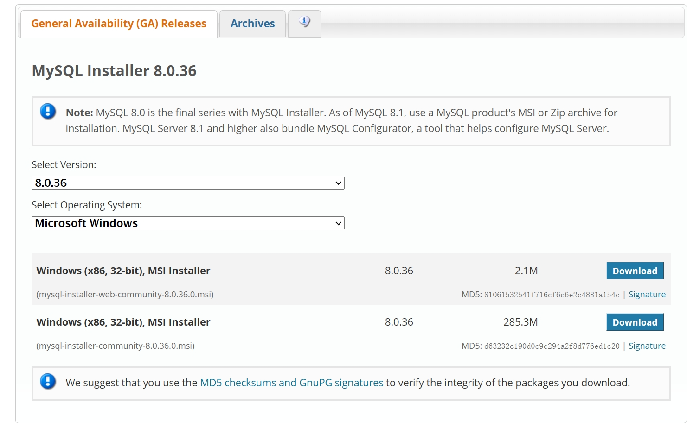

# **MySQL安装与配置**

### 检查电脑名称中是否含有中文字符

在安装前，你需要检查电脑(设备)名称中是否含有中文字符，如果含有中文字符，后续安装可能会失败。（修改电脑名称即可）

### 安装MySQL(8.0版本)
> 具体安装教程请参看我的博客：**[MySQL安装教程](https://blog.csdn.net/Cosmo9/article/details/132845215)**

#### 1. 通过[MySQL 8.0官网](https://dev.mysql.com/downloads/windows/)下载安装包：

>如图所示：



有两个下载选项，选择第二个完整的离线安装包（无web字样），点击Download进行下载。  
下载后打开进入安装即可

#### 2. 进行自定义安装：

```
    如果想要自定义安装的路径（如D盘），那么请选择Custom，选择Custom后，根据自己需求手动选择要安装的组件。  
    选择好组件之后，需要一个一个点击右边的组件，并点击下方的 Adavanced Options（高级选项），自定义其安装路径。  
    选择完安装路径后，点击 Next;  
    点击Execute检查运行环境；  
    点击Next；Yes；  
    点击Execute安装MySQL;  
    Next到"Type and Networking"这一页，开始进入配置阶段；  
    "Type and Networking"默认，点击Next；  
    选择密码类型：默认第一个即可；  
    Next；输入root权限的密码：第一行输入，第二行确认；  
    Next；Next；  
    点击Execute写入刚才的配置；  
    稍等片刻；待所有对勾打完后，点击Finish完成对MySQL服务器的配置；  
    Next；Finish；Next；  
    在Password一栏中输入刚才设置的密码，点击Check验证；  
    密码正确后，点击Next；Execute；Finish；Next；Finish；安装成功。  
```

> 由于安装时间过于久远，此处没有图片指引，按照文字进行操作即可。


### MySQL 系统环境变量配置

找到系统环境变量，在path中添加**MySQL下bin目录的路径**即可

### 验证MySQL安装是否成功

在命令行输入

```
    mysql -u root -p
```

输入设定的密码，成功登入即可验证安装成功

### 可能遇到的问题

+ #### 重启电脑后MySQL无法打开：
  在计算机管理中找到服务与应用程序—服务，下拉找到 MySQL（有可能有后缀，比如我电脑上是 MySQL80 ），右键启动即可。

+ #### ERROR 1045 (28000): Access denied for user 'root'@'localhost' (using password: YES)
  密码错误

+ #### 无法启动mysql：
使用管理员命令行面板（开始搜索栏搜索cmd，以管理员身份运行），输入  

```
    net start mysql;
```

### 查找MySQL全局配置文件(my.ini)

#### 1. 通过命令行登录MySQL

```
    mysql -u root -p
    # 输入安装时设定的密码
```

#### 2. 查询MySQL数据存放目录(datadir)

```sql
    # 若按照上述教程安装，此处应输出 D:\MySQL\MySQL Server 8.0\Data
    SELECT @@datadir; 
```

### 修改MySQL配置文件内容

>目的：提前把字符集设置为utf-8，省去后续调整  

> 此为mysql8.0版本，如自定义了路径(如上述安装教程)，需要在basedir、datadir后输入mysql本体和数据存储的路径

#### 1. 找到my.ini所在目录，用记事本打开, 将其替换为以下内容：

```
    [mysqld]
    port=3306
    basedir=C:\Program Files\MySQL\MySQL Server 8.0
    datadir=C:\ProgramData\MySQL\MySQL Server 8.0\Data
    max_connections=200
    max_connect_errors=10
    character-set-server=utf8
    default-storage-engine=INNODB
    default_authentication_plugin=mysql_native_password
    skip_ssl
    default-time_zone='+8:00'
    [mysql]
    default-character-set=utf8
    [client]
    port=3306
    default-character-set=utf8
```

如未找到my.ini或其在data内，在桌面创建txt文档，修改名字与后缀为my.ini，键入配置文件内容，放入mysql本体目录下即可。  

#### 2. 若mysql已经启动(一般是自动启动), 修改完配置文件需要重启mysql: 以**管理员权限**打开cmd窗口, 输入

>注意：mysql的名字可能不同，如我的mysql在系统名字中为mysql80，需要将上述为mysql的地方改为mysql80

```
    net stop mysql
    net start mysql
```

命令行登入测试即可