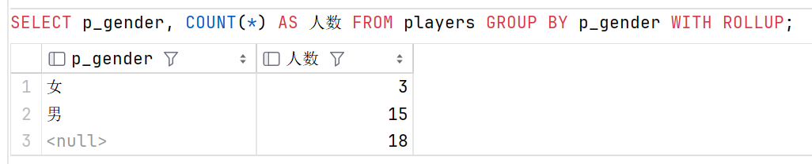
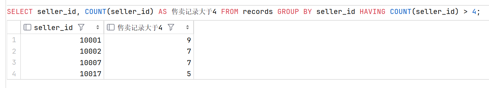
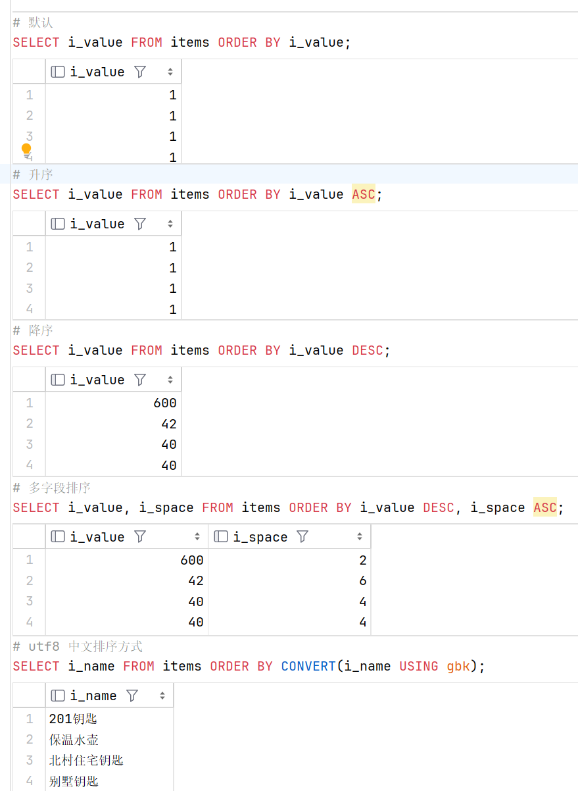

# **3.3 分组与排序**


### **结果分组 GROUP BY**

#### 为什么需要分组？

在[上一章](./查询函数.md)中我们提到了聚集函数的概念，它能对一组数据(一列数据)进行统计操作，如求和、平均值、最大值、最小值等，并返回单个值 ( 结果 )。

然而，在实际需求中，我们常需要将结果分类展示，最经典的：在表中男女各有多少人？我们很轻松的就能想到使用聚合函数计数，如：

```sql
    # 查两次 ？
    SELECT COUNT(p_id) AS 男性数目 FROM players WHERE p_gender = '男';
    SELECT COUNT(p_id) AS 女性数目 FROM players WHERE p_gender = '女';
    # 当然你也可以这样写
    SELECT
        SUM(IF(p_gender = '男', 1, 0)) AS 男性数目,
        SUM(IF(p_gender = '女', 1, 0)) AS 女性数目
    FROM players;
```

但是这太麻烦了不是吗？这就需要先对数据进行分组，再对分组结果进行聚合 (  GROUP BY 子句将结果集划分为值分组，聚合函数为每个分组返回单个值 )

```sql
    SELECT p_gender, COUNT(p_gender) AS 人数 FROM players GROUP BY p_gender;
```


#### 同时获取分组结果和汇总结果 WITH ROLLUP

如果既想要分组结果，又想获得汇总结果，可以在 `GROUP BY` 后面加上 `WITH ROLLUP` 关键字，对分组后的数据进行汇总计算，在查询得到的结果中添加一行汇总的结果，相当于整合了一个 `COUNT(*) FROM` 结果集的查询结果，如：

```sql
    SELECT p_gender, COUNT(*) AS 人数 FROM players GROUP BY p_gender WITH ROLLUP;
```



#### 需要汇总/分组结果进行筛选 HAVING

在[上一章](./查询函数.md)的最后我们提到，`WHERE` 语句不能和聚集函数一起使用，因此，当需要汇总/结果分组结果进行筛选时，我们需要使用 `HAVING` 语句，它的用法与 `WHERE` 基本相同。

```sql
    SELECT seller_id, COUNT(seller_id) AS 售卖记录大于4 FROM records GROUP BY seller_id HAVING COUNT(seller_id) > 4;
```



### **结果排序 ORDER BY** 

> 注意：`ORDER BY` 语句必须出现在整个 `SELECT` 语句的最后

+ #### 排序方式

|排序方式关键字|排序方式|
|-----|-----|
|ASC|升序，默认排序方式，可不写出|
|DESC|降序，如果使用必须写出|

+ #### 示例

```sql
    # 默认
    SELECT i_value FROM items ORDER BY i_value;
    # 升序
    SELECT i_value FROM items ORDER BY i_value ASC;
    # 降序
    SELECT i_value FROM items ORDER BY i_value DESC;
    # 多字段排序
    SELECT i_value, i_space FROM items ORDER BY i_value DESC, i_space ASC;
    # utf8 中文排序方式
    SELECT i_name FROM items ORDER BY CONVERT(i_name USING gbk);
```

