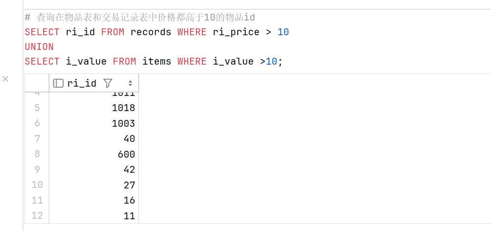
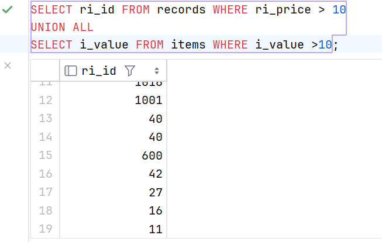

# **3.5 合并查询**

> 相比较于上一章中提到的复杂查询中的连接操作，使用 UNION 可以减少匹配次数，相当于乘法转化为加法，提高效率


### UNION 关键字

`UNION` 操作符用于合并两个或多个 `SELECT` 语句的结果集。

**<center>A ⋃ B</center>**

在 MySQL 中，使用 `UNION` 关键字需要遵从以下规则：

1. `UNION` 必须由两条或两条以上的 `SELECT` 语句组成
2. `UNION` 的每个 `SELECT` 语句必须拥有相同数量的字段，次序可不一致
3. `UNION` 的每个 `SELECT` 语句合并的列字段类型必须相同 ( 可隐式转化也行 )

例子：

```sql
    # 查询在物品表和交易记录表中价格都高于10的物品id
    SELECT ri_id FROM records WHERE ri_price > 10
    UNION
    SELECT i_value FROM items WHERE i_value >10;
```



### UNION ALL

`UNION ALL` 与 `UNION` 的区别在于，`UNION ALL` 将不会对合并结果进行去重，

```sql
    SELECT ri_id FROM records WHERE ri_price > 10
    UNION ALL
    SELECT i_value FROM items WHERE i_value >10;
```

