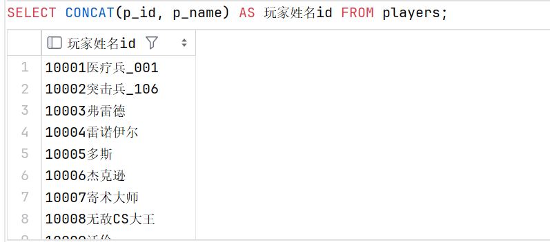
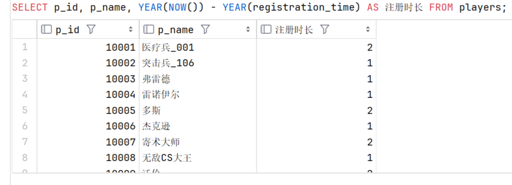

# **3.2 查询函数**

### **计算字段**

当存储在数据库表中的数据不能直接满足我们的需求时，就需要我们利用已有的字段创造出所需内容，这就是计算字段

+ #### 拼接 CONCAT( )

    + 字段与字段拼接

    ```sql
        SELECT CONCAT(p_name, p_id) FROM players;
    ```

    + 字符与字段拼接

    ```sql
        SELECT CONCAT('昂贵的', i_name)  FROM items WHERE i_name REGEXP '金';
    ```


+ #### 使用字段别名 AS

> 拼接后字段名消失，MySQL 不方便识别，因此使用字段别名

> 可以省略 AS，但是为了规范我们不省略 AS

```sql
    SELECT CONCAT(p_id, p_name) AS 玩家姓名id FROM players;
```



+ #### 算术运算：+ - * /

```sql
    SELECT p_id, p_name, YEAR(NOW()) - YEAR(registration_time) AS 注册时长 FROM players;
```



### **使用函数**

> 这一部分只做介绍，实际查询可以参考上述**计算字段**的使用，只需要把计算字段换成相应的函数即可

#### **文本处理函数**

|函数名|函数作用|
|-----|-----|
|UPPER(~)|将字符串转换为大写|
|LOWER(~)|将字符串转换为小写|
|LENGTH(~)|返回字符串的长度|
|LEFT(~,n)|返回字符串左边第n个字符|
|RIGHT(~,n)|返回字符串右边第n个字符|
|SUBSTRING(~,m,n)|返回字符串从m开始的n个字符|
|LTRIM(~)|去除字符串左边的空格|
|RTRIM(~)|去除字符串右边的空格|
|TRIM(~)|去除字符串两边的空格|
|REPLACE(~,a,b)|将字符串中的a替换为b|
|CONCAT(~,~,~,...)|将多个字符串连接起来|

#### **数值处理函数**

|函数名|函数作用|
|-----|-----|
|ABS(~)|取绝对值|
|CEIL(~)|向上取整|
|FLOOR(~)|向下取整|
|ROUND(~,n)|四舍五入|
|SQRT(~)|开平方|
|POWER(~,n)|幂函数|

#### **日期和时间处理函数**

|函数名|函数作用|
|-----|-----|
|CURDATE()|返回当前日期|
|CURTIME()|返回当前时间|
|NOW()|返回当前时间|
|YEAR(~)|返回日期的年|
|MONTH(~)|返回日期的月|
|DAY(~)|返回日期的日|
|DATEDIFF(~,~)|返回两个日期之间的天数|

### **聚集函数**

> 对一组数据(一列数据)进行统计操作，如求和、平均值、最大值、最小值等，返回单个值

#### **常见的聚集函数：**

> SUM( )、AVG( ) 仅对数值类型计算，MAX( ), MIN( ) 可对任意类型的列

+ COUNT( ) 计数 

    > null值字段不参与运算，因此选取计算的字段时一般选择非空字段，如主键或主属性(id)

    COUNT( ) 函数还可以使用 DISTINCT 关键字来忽略重复项，统计数目，比如

    ```sql
        # 统计交易记录中有多少个不同的物品
        SELECT COUNT(DISTINCT ri_id) AS 交易记录物品类别数 FROM records;
    ```


+ SUM( ) 总计

+ AVG( ) 平均值

+ MAX / MIN( ) 最大值 / 最小值

#### **WHERE 与聚集函数**

**在WHERE 子句中不能使用聚集函数**

聚集函数也叫列函数，基于整列数据进行计算，而 WHERE 子句则是对数据进行过滤。在 WHERE 字句执行结束前，聚集函数无法获得列数据 ( 列数据需要等待 WHERE 子句通过行条件进行过滤后才能获得 ) ，因此，WHERE 子句中不能使用聚集函数。