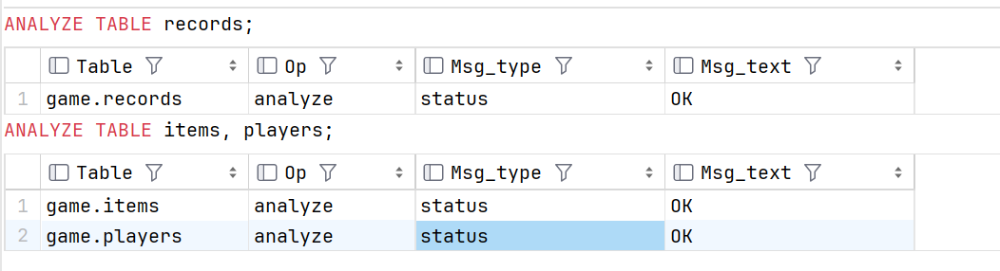
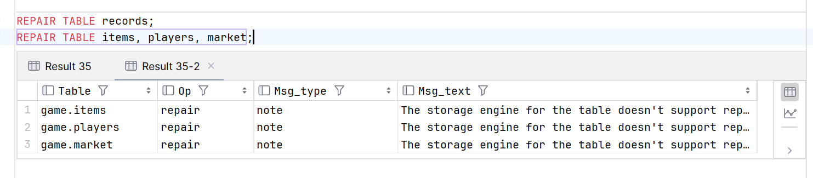

# 维护表

定期的维护数据表是一个很好的习惯。对提高数据库的性能很有帮助。

MySQL 提供了几个维护数据库表的语句：

| 语句 | 作用 |
|:---:|:---:|
| ANALYZE TABLE | 分析表 |
| OPTIMIZE TABLE | 优化表 |
| CHECK TABLE | 检查表 |
| REPAIR TABLE | 修复表 |

### 分析表 

MySQL 使用 ANALYZE TABLE 语句分析表，它用于分析和存储键的分布。分析表的结果将可以使得系统得到准确的统计信息，使得 SQL 能够生成正确的执行计划。

典型的，在一个表中进行了大量数据插入，更新或者删除操作后，键分布可能是不准确的。如果键分布不准确，查询优化器可能会选择错误的查询执行计划，这可能会导致严重的性能问题。


```sql
    ANALYZE TABLE records;
    ANALYZE TABLE items, players;
```



### 优化表

MySQL 使用 OPTIMIZE TABLE 语句优化表，它的主要作用是消除更新或者删除造成空间浪费。

典型的，在一个表中进行了大量数据更新或者删除操作后，表的物理存储可能变得碎片化，导致数据库服务器的性能下降。

```sql
    OPTIMIZE TABLE records;
    OPTIMIZE TABLE items, players, market;
```

> 不过按照文档的说法直接优化 InnoDB 表会报错，如图所示 Table does not support optimize，似乎需要用 mysqld --skip-new 或者 mysqld --safe-mode 命令来重启MySQL，参见[回答](https://blog.csdn.net/agonie201218/article/details/124970247)


### 检查表

数据库服务器可能发生一些错误，例如服务器意外关闭、向硬盘写入数据时出错等。这些情况可能导致数据库运行不正确，最坏的情况可能是崩溃。

MySQL 允许您使用 CHECK TABLE 语句检查数据库表的完整性。

```sql
    CHECK TABLE records;
    CHECK TABLE items, players, market;
```

> CHECK TABLE 语句仅检测数据库表中的问题，但不会修复它们。要修复表，请使用 REPAIR TABLE 语句。


### 修复表

REPAIR TABLE 语句允许您修复数据库表中发生的一些错误。MySQL 不保证 REPAIR TABLE 语句可以修复表可能存在的所有错误。

REPAIR TABLE 只支持 MyISAM 引擎。否则会给出提示: The storage engine for the table doesn’t support repair。

> 我们使用的是 InnoDB 引擎，所以无法使用 REPAIR TABLE。

```sql
    REPAIR TABLE records;
    REPAIR TABLE items, players, market;
```
