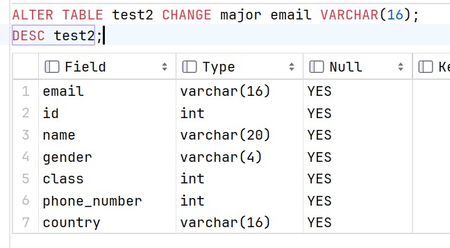
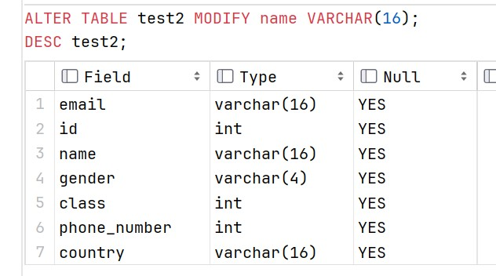
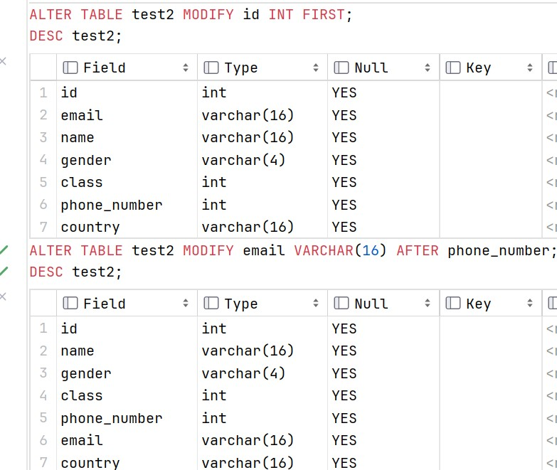
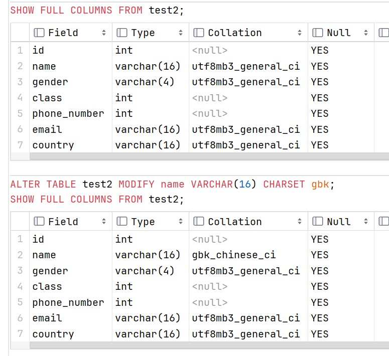
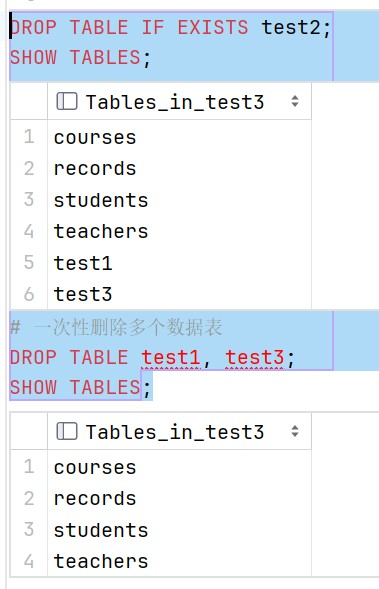

# 数据表操作

### 查看数据表 SHOW/DESC

+ #### 查看当前数据库中已有的数据表:

```sql
    # 先选择使用的数据库(test3中已建好表)
    USE test3;
    SHOW TABLES;
```


+ #### 查看指定表结构： 

```sql
    # DESC是DESCRIBE的简写，也可完整写出进行查看
    DESC students;
    # 效果相同
    SHOW COLUMNS FROM students;
    # 显示完整表结构
    SHOW FULL COLUMNS FROM students;
```


+ #### 查看数据表创建语句

```sql
    SHOW CREATE TABLE students;
```


### 创建数据表 CREATE

#### 创建数据表语法：

```sql
    CREATE TABLE 表名称(
​        列名1 数据类型1，
        列名2 数据类型2，
             ....
        列名n 数据类型n
        # 注意：最后一列，不需要加逗号
    );
```

#### 创建数据表：

+ ##### 判断不存在创建数据表

```sql
    CREATE TABLE IF NOT EXISTS test1(
        id INT,
        name VARCHAR(20)
    );
    # 验证是否成功创建
    SHOW TABLES;
    DESC test1;
```


+ ##### 在创建数据表时指定字符集

> 由于修改了配置文件，默认为 utf8 , 为展示效果指定为gbk

```sql
    CREATE TABLE IF NOT EXISTS test2(
        id INT,
        name VARCHAR(20)
    ) CHARSET gbk;
    SHOW FULL COLUMNS FROM test2;
```


+ ##### 在创建数据表时为列添加备注信息

```sql
    CREATE TABLE IF NOT EXISTS test3(
        id INT COMMENT '学号',
        name VARCHAR(20) COMMENT '姓名'
    );
    SHOW FULL COLUMNS FROM test3;
```


### 修改数据表 ALTER

>  字段名：数据表的列名

+ #### 修改字符集  CHARSET

```sql
    # CHARSET 是 CHARACTER SET的缩写
    ALTER TABLE test2 CHARSET utf8;
    SHOW CREATE TABLE test2;
```


+ #### 修改表名称  RENAME

```sql
    ALTER TABLE test2 RENAME AS test4;
    SHOW TABLES;
    # 等效
    RENAME TABLE test4 to test0;
    SHOW TABLES;
```


+ #### 新增字段 ADD

```sql
    # 在最后添加一个字段：
    ALTER TABLE test2 ADD gender VARCHAR(4);
    DESC test2;
    # 在最前添加一个字段
    ALTER TABLE test2 ADD major VARCHAR(8) FIRST;
    DESC test2;
    # 一次添加多个字段：
    ALTER TABLE test2 ADD(
            class INT,
            country VARCHAR(16)
        );
    DESC test2;
    # 指定字段后添加字段：
    ALTER TABLE test2 ADD phone_number INT AFTER class;
    DESC test2;
```


+ #### 修改字段 CHANGE/MODIFY

    + 修改字段名：

    ```sql
        ALTER TABLE test2 CHANGE major email VARCHAR(16);
        DESC test2;
    ```

    

    + 修改字段类型：

    ```sql
        ALTER TABLE test2 MODIFY name VARCHAR(16);
        DESC test2;
    ```

    

    + 修改字段位置：

    ```sql
        ALTER TABLE test2 MODIFY id INT FIRST;
        DESC test2;
        # 指定字段后添加字段：
        ALTER TABLE test2 MODIFY email VARCHAR(16) AFTER phone_number;
        DESC test2;
    ```

    

    + 修改字段字符集：

    ```sql
        SHOW FULL COLUMNS FROM test2;
        ALTER TABLE test2 MODIFY name VARCHAR(16) CHARSET gbk;
        SHOW FULL COLUMNS FROM test2;
    ```

    

+ #### 删除字段 DROP

```sql
    # COLUMN 可省略
    ALTER TABLE test2 DROP COLUMN country;
    DESC test2;
    # 删除多个字段
    ALTER TABLE test2
        DROP gender,
        DROP class,
        DROP email,
        DROP phone_number;
    DESC test2;
```


### 删除数据表 DROP

```sql
    DROP TABLE IF EXISTS test2;
    SHOW TABLES;
    # 一次性删除多个数据表
    DROP TABLE test1, test3;
    SHOW TABLES;
```



> **注意，数据表可以一次删除多个，但数据库只能一个一个删除**
