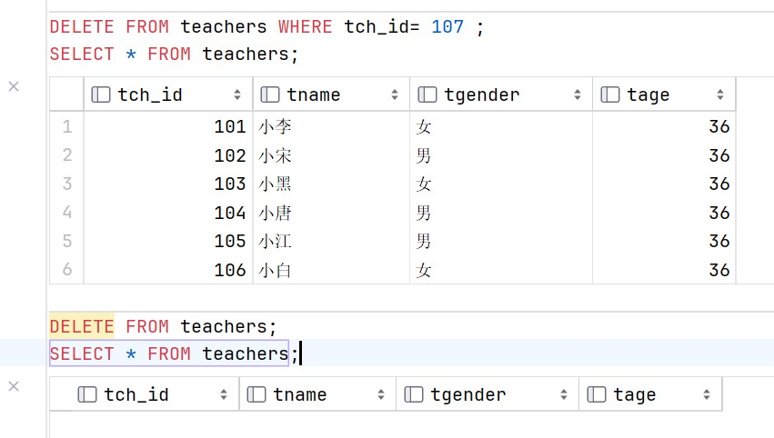

# 数据表数据操作

由于在这一部分中涉及到数据的添加，这受到数据库完整性 ( 主键，外键 ) 约束，比如外键字段对主表字段的依赖性，因此不使用存在约束的数据库 `test3` ，使用在 2.1 节中创建的空数据库 `test5` ，在 `test5` 中创建数据表 `teachers`

```sql
CREATE TABLE teachers
(
    tch_id  INT ,
    tname   VARCHAR(8),
    tgender CHAR,
    tage    TINYINT
);
```

当然啦，要看到这一节的可视化效果，我们需要知道一条查看数据表数据的 sql 查询语句：

```sql
SELECT * FROM teachers;
```

本章就只使用这条查询语句来展示对数据表数据的操作


### 插入数据 INSERT INTO + VALUES / SET

+ #### 添加一条记录

>除了数字类型，其他类型的值需要使用引号(单双都可以)引起来

```sql
# 可以省略表名后的字段名，图中就是省略字段名的情况
INSERT INTO teachers (tch_id, tname, tgender, tage)
    VALUES
        (101,'小李','女',31);
SELECT * FROM teachers;
```


+ #### 一次添加多条记录

```sql
INSERT INTO teachers (tch_id, tname, tgender, tage)
    VALUES
        (102, '小宋', '男', 46),
        (103, '小黑', '女', 33),
        (104, '小唐', '男', 42),
        (105, '小江', '男', 51),
        (106, '小白', '女', 27);
SELECT * FROM teachers;
```


+ #### 通过 SET 形式插入记录 ( 不推荐 )

```sql
INSERT INTO teachers
    SET
        tch_id = 107,
        tname = '小红',
        tgender = '女',
        tage = 33;
SELECT * FROM teachers;
```


### 修改数据 UPDATE + SET

+ #### 使用 WHERE 条件表达式修改

```sql
UPDATE 表名 SET 
    字段名1=值1,
    字段名2=值2,
    ...,
    WHERE 条件表达式;
```

> 如果不加 `WHERE` 条件，将修改全部数据

+ #### 不使用 WHERE 条件表达式修改全表数据

```sql
UPDATE 表名 SET 
    字段名1=值1,
    字段名2=值2,
    ...;
```


### 删除数据  DELETE / TRUNCATE

为了比较 `DELETE` 和 `TRUNCATE` 的区别，我们创建一个新的数据表 `teacher`，和 `teachers` 表删去 107 后一模一样

```sql
CREATE TABLE teacher
(
    tch_id  INT ,
    tname   VARCHAR(8),
    tgender CHAR,
    tage    TINYINT
);
INSERT INTO teacher (tch_id, tname, tgender, tage)
    VALUES
        (101, '小李', '女', 31);
        (102, '小宋', '男', 46),
        (103, '小黑', '女', 33),
        (104, '小唐', '男', 42),
        (105, '小江', '男', 51),
        (106, '小白', '女', 27);
```

+ #### 删除数据 —— 相当于一列一列清除

```sql
DELETE FROM teachers WHERE tch_id= 107 ;
SELECT * FROM teachers;
# 不加WHERE 清除所有数据
DELETE FROM teachers;
SELECT * FROM teachers;
```



+ #### 清空数据表 —— 相当于删除表，重建新的同名空表

```sql
TRUNCATE TABLE teacher;
SELECT * FROM teacher;
```


+ #### **DELETE 和 TRUNCATE 差异**

    `DELETE` 和 `TRUNCATE` 的区别是:

    + `DELETE` 是逐行删除数据，而 `TRUNCATE` 是清空数据表，重建新的同名空表

    + `DELETE` 支持回滚，`TRUNCATE` 不支持回滚

    + `DELETE` 会触发触发器，`TRUNCATE` 不会触发触发器

    从下图中可以看出，`DELETE` 删除表的速度比 `TRUNCATE` 快很多，这是因为此时数据量小，重建表的时间大于逐行删除的时间，当数据量大时，使用 `TRUNCATE` 会明显提升速度，但是 `TRUNCATE` 不支持回滚，因此要小心地使用 `TRUNCATE`。

    

