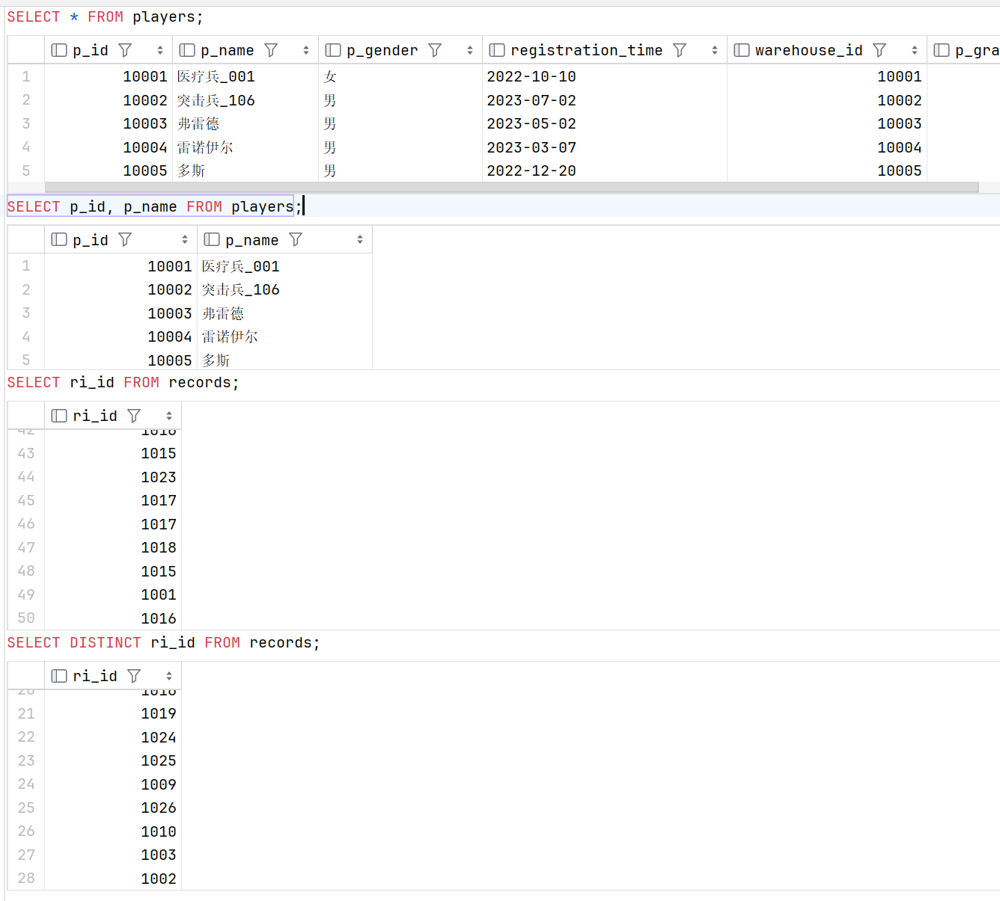
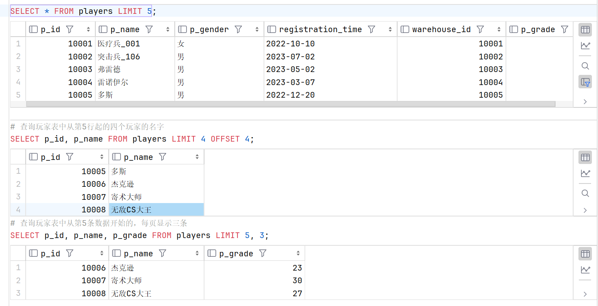
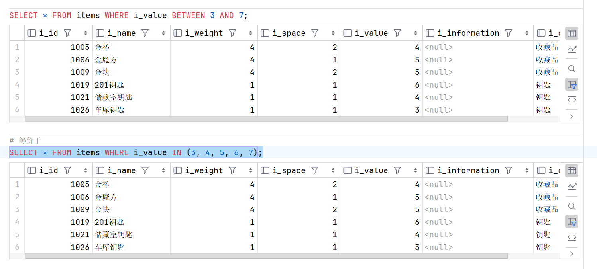
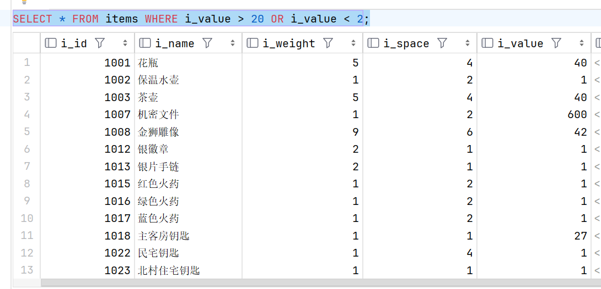
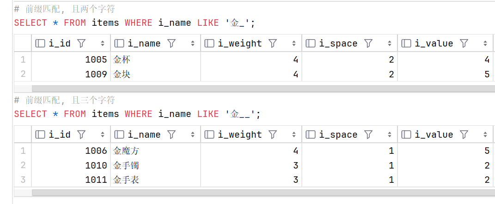
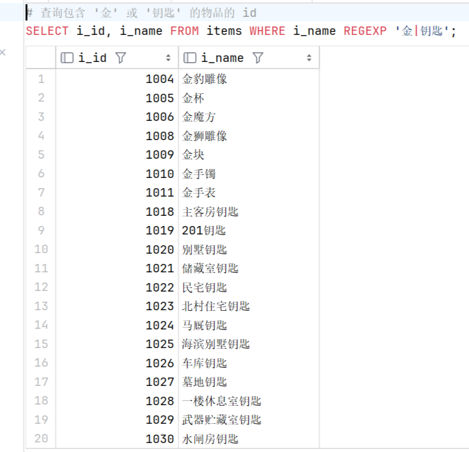
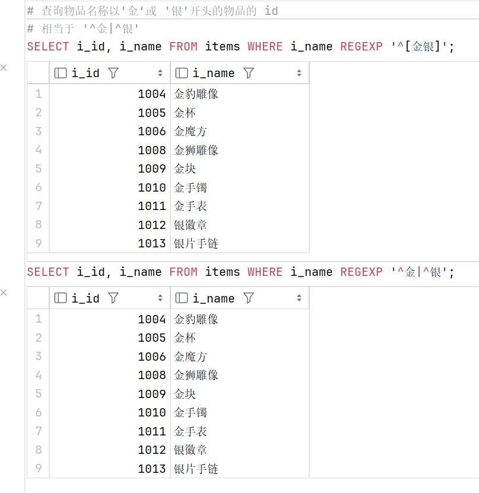

# **3.1 基本查询**

### 查询语句语法：( [] 内为可省略内容 )

```sql
SELECT [DISTINCT]
    字段列表
FROM
    表名列表
[
WHERE
    条件列表
GROUP BY
    分组字段
HAVING
    分组之后的条件
ORDER BY
    排序
​LIMIT
    分页限定
]
```

### **简单查询**

#### **基础查询**

+ ##### 查询表中全部数据

```sql
    SELECT * FROM players;
```

+ ##### 查询指定列

```sql
    SELECT p_id, p_name FROM players;
```

+ ##### 查询时去除重复值

```sql
    SELECT ri_id FROM records;
    SELECT DISTINCT ri_id FROM records;
```

可以看到，不去重共有50条数据，去重后只有28条数据



#### **限制查询 LIMIT**

+ ##### 查询前n条数据

```sql
    SELECT * FROM players LIMIT 5;
```

+ ##### 查询指定位置开始的前n条数据 OFFSET

```sql
    # 查询玩家表中从第5行起的四个玩家的名字
    SELECT p_id, p_name FROM players LIMIT 4 OFFSET 4;
```

+ ##### 实现分页查询 SELECT 字段名 FROM 表名 LIMIT 开始的索引, 每页显示的条数;

```sql
    # 查询玩家表中从第5条数据开始的，每页显示三条
    SELECT p_id, p_name, p_grade FROM players LIMIT 5, 3;
```




### **条件查询**

> MySQL 默认不区分大小写，要区分的话需要使用 BINARY 关键字区分大小写

#### **过滤查询 WHERE**

+ ##### WHERE 字句操作符

    + 逻辑比较：=、>、<、>=、<=、<> ( != )

    + 范围检查：BETWEEN AND / IN

    ```sql
        SELECT * FROM items WHERE i_value BETWEEN 3 AND 7;
        # 等价于
        SELECT * FROM items WHERE i_value IN (3, 4, 5, 6, 7);
    ```
    

    + 空值检查：IS NULL / IS NOT NULL

        > 不可使用 = 和 != 检查

+ ##### 使用 AND / OR 连接多个过滤查询

```sql
    SELECT * FROM items WHERE i_value > 20 OR i_value < 2;
```



AND 优先级比 OR 高，优先执行。若需表达复杂逻辑关系，可使用括号，或者使用 IN() 操作符，如：

```sql
    WHERE id IN(3,4) AND grade=9;
```

#### **模糊查询 LIKE**

+ ##### '%' 代表任意字符出现任意次数

```sql
    # 前缀匹配
    SELECT * FROM items WHERE i_name LIKE '金%';
    # 后缀匹配
    SELECT * FROM items WHERE i_name LIKE '%壶';
    # 包含匹配
    SELECT * FROM items WHERE i_name LIKE '%火%';
```


+ ##### '_' 代表一个字符

```sql
    # 前缀匹配, 且两个字符
    SELECT * FROM items WHERE i_name LIKE '金_';
    # 前缀匹配, 且三个字符
    SELECT * FROM items WHERE i_name LIKE '金__';
```



+ ##### '\\' 转义字符

> 在 MySQL 中路径用 / 隔开

若要查询含下划线 '_' 的，需要在下划线前加上 \ ，如:

```sql
    # 名称中含有下划线的玩家的 id
    SELECT p_id FROM players WHERE p_name LIKE '%\_%';
```


#### **正则查询 REGEXP**

+ ##### 正则表达式 ( regular expression )

    + 查询包含 '金' 或 '钥匙' 的物品的 id 和名称

    ```sql
        SELECT i_id, i_name FROM items WHERE i_name REGEXP '金|钥匙';
    ```

    

    + 查询姓名中包含英文字母的玩家的 id 和姓名

    ```sql
        SELECT p_id, p_name FROM players WHERE p_name REGEXP '[A-Za-z]';
    ```

    

    + 查询姓名中包含3个及以上连续数字的玩家的 id 和姓名

    ```sql
        SELECT p_id, p_name FROM players WHERE p_name REGEXP '[0-9]{3,}';
    ```

    

    + 查询物品名称以'金'或 '银'开头的物品的 id 和名称

    ```sql
        # 相当于 '^金|^银'
        SELECT i_id, i_name FROM items WHERE i_name REGEXP '^[金银]';
        SELECT i_id, i_name FROM items WHERE i_name REGEXP '^金|^银';
    ```

    

    + 查询物品名称以'壶'结尾的物品的 id 和名称

    ```sql
        SELECT i_id, i_name FROM items WHERE i_name REGEXP '瓶$';
    ```

    

+ ##### REGEXP 和 LIKE 的区别

如果不使用通配符，LIKE 对整个字段进行比对，而REGEXP 只对正则表达式内容进行比对。

```sql
    SELECT * FROM items WHERE i_name LIKE '壶';
    SELECT * FROM items WHERE i_name REGEXP '壶';
```
也就是说，第一个查询查找的是'壶'这个字符串, 而第二个查找的是包含'壶'的字符串


