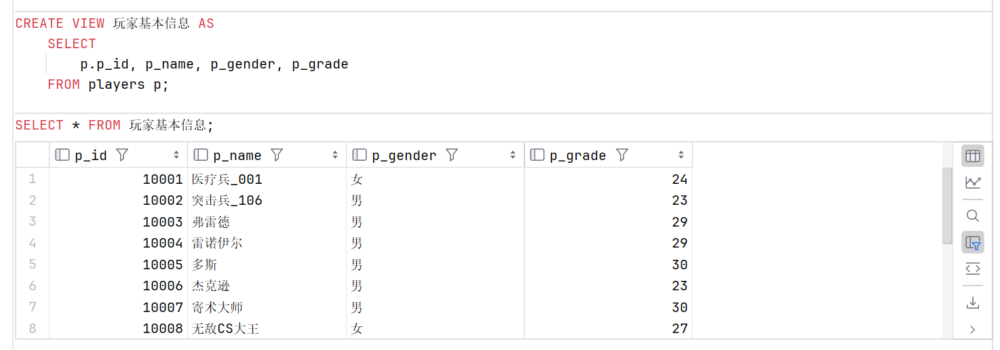

# **视图**

> 实际上是对查询的一种抽象实例，个人感觉视图像是 C++ 中的引用，访问视图就是通过其定义的引用，访问对应列。可以把视图当成一个虚拟表使用。

### 创建视图

#### 语法：

```sql
    CREATE [OR REPLACE] [ALGORITHM = {UNDEFINED | MERGE | TEMPTABLE}] 
    VIEW 视图名称 [(字段列表)] 
    AS 查询语句 [WITH [CASCADED|LOCAL] CHECK OPTION]
```

+ `OR REPLACE`：如果视图已经存在，则先删除再创建

+ `ALGORITHM`：视图的算法，默认为 `UNDEFINED`，可选值为 `MERGE` 和 `TEMPTABLE`

+ `WITH [CASCADED|LOCAL] CHECK OPTION`：视图的 CHECK OPTION，默认为 `CASCADED`，可选值为 `CASCADED` 和 `LOCAL`

    > 该选项的作用是：通过视图插入、删除或修改元组时检查元组是否满足视图定义中的条件，如果不满足将拒绝执行这些操作。

+ `字段列表`：视图的字段列表，如果不指定，则默认为查询语句中的字段列表

    > 如果视图定义语句中含有列名表选项，则该选项中的列名个数和次序都要与`SELECT`后的列名表一致。

+ `查询语句`：视图的查询语句，必须为 `SELECT` 语句

    > 在视图定义的 `SELECT` 语句中，不能包含 `ORDER BY` 关键字

#### 常见示例

+ 单表视图

```sql
    CREATE VIEW 玩家基本信息 AS
        SELECT  
            p_id, p_name, p_gender, p_grade
        FROM players; 
    SELECT * FROM 玩家基本信息;
```



+ 在视图中使用别名

    > 除去在 SELECT 语句中直接使用别名外，还可以使用视图中的别名使用法。

```sql
    # 删去旧视图
    DROP VIEW 玩家基本信息;

    # 指定视图中别名
    CREATE VIEW 玩家基本信息 (id, name, gender, grade) AS
        SELECT
            p.p_id,  p_name, p_gender, p_grade
        FROM players p;

    SELECT * FROM 玩家基本信息;

```


+ 多表视图

+ 基于视图的视图

