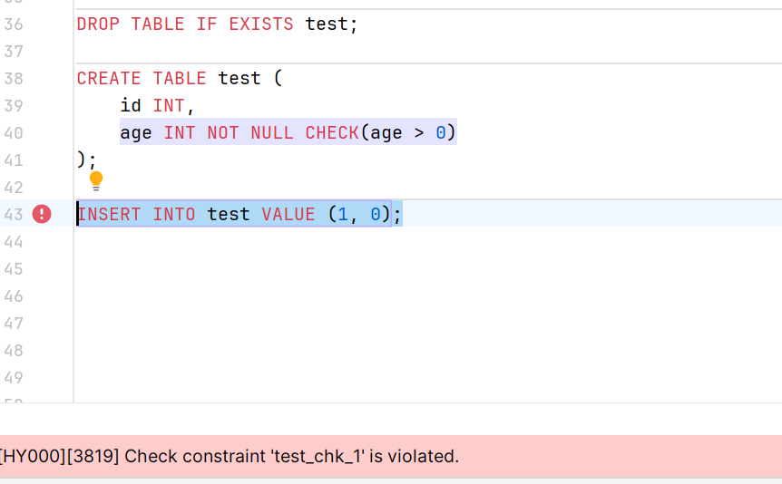

# **数据库完整性**

> 数据的正确性(设计要求)和相容性(一致性); 本章的最后会展示使用数据库完整性约束重构的数据库 game，原始数据库建立参见[第三章](../chapter3/README.md)

### 关于键/码的相关术语

> 候选码、主码简称码

+ 超码/超键 ( super key )：在关系中某一属性能唯一的标识一个元组(表中的一条记录)的称该属性为超键

+ 候选码/候选键 ( candidate key )：当超键中不含有多余属性时称为候选键
    
    > 候选键中的属性称为主属性，不包含在任何候选键中的属性称为非主属性

+ 主码/主键 ( primary key )：用户根据需要选定多个候选键中的一个作为主键

+ 外码/外键 ( foreign key )：如果某属性不是关系 R1 的码，而在另一个关系 R2 中是主键，则该属性是关系模式 R1 的外键，其参照于 R2 的主键

### 实体完整性
        
主键约束：`PRIMARY KEY`

> 限定字段非空且唯一

#### 添加主键：

##### 语法：

```sql
CREATE TABLE 表名 (字段名1 字段类型1 PRIMARY KEY, 字段名2 字段类型2, ...字段名n 字段类型n);
CREATE TABLE 表名 (字段名1 字段类型1, 字段名2 字段类型2, ...字段名n 字段类型n, PRIMARY KEY(字段名)); 
```

##### 示例：

+ 在创建表时，添加主键约束

```sql
# 针对列的声明
DROP TABLE IF EXISTS test;
CREATE TABLE test (id INT PRIMARY KEY);
DESC test;
# 针对表的声明。创建联合主键：PRIMARY KEY (字段名1, 字段名2);
DROP TABLE test;
CREATE TABLE test (id INT, name VARCHAR(20), registration_data DATE, PRIMARY KEY(id, registration_data));
DESC test;
```


+ 创建完表后，添加主键

    > 需要注意的是，一个表只能有一个主键，因此只能在没有主键的表中添加主键。

```sql
# 先删除原有主键 
ALTER TABLE test DROP PRIMARY KEY;
DESC test;
# 针对列的声明
ALTER TABLE test MODIFY id INT PRIMARY KEY;
DESC test;
# 先删除原有主键 
ALTER TABLE test DROP PRIMARY KEY;
DESC test;
# 针对表的声明
ALTER TABLE test ADD PRIMARY KEY(id, registration_data);
```


#### 删除主键

```sql
# 和索引不一样的是不需要知道主键名字
ALTER TABLE test DROP PRIMARY KEY;
DESC test;
```


### 参照完整性

外键约束  `CONSTRAINT` + `FOREIGN KEY` + `REFERENCES`

> 在创建表时需要注意创建顺序，保证不引用不存在的数据（也就是说对于该属性而言的主表必须先有这个属性的数据，该属性的从表中才能有与之相同的数据）

> 此外，外键约束中，外键列不能是主键，主表列必须是主键或唯一键值

#### 添加外键

##### 语法：

```sql
CREATE TABLE IF NOT EXIST 表名(所有字段名声明及主键声明, CONSTRAINT [外键名] FOREIGN KEY (外键列名称) REFERENCES 主表名(主表字段名));
ALTER TABLE 表名 ADD CONSTRAINT [外键名] FOREIGN KEY (外键列名称) REFERENCES 主表名(主表字段名);
```

##### 示例：

+ 在创建表时添加外键

```sql
DROP TABLE IF EXISTS test;
DROP TABLE IF EXISTS record;
CREATE TABLE test(
    id INT,
    name VARCHAR(20),
    registration_date DATE,
    PRIMARY KEY (id)
);
CREATE TABLE record(
    r_id INT,
    r_name VARCHAR(20),
    CONSTRAINT FOREIGN KEY (r_id) REFERENCES test(id)
);
# 系统会自动给外键一个名称
SELECT * FROM information_schema.KEY_COLUMN_USAGE WHERE REFERENCED_TABLE_NAME='test';
```


+ 创建表之后添加外键

```sql
ALTER TABLE test ADD UNIQUE(name);
ALTER TABLE record ADD CONSTRAINT 名字依赖  FOREIGN KEY (r_name) REFERENCES test(name);
SELECT * FROM information_schema.KEY_COLUMN_USAGE WHERE REFERENCED_TABLE_NAME='test';
```


#### 删除外键

```sql
# 也可以通过查看数据库创建语句查看外键名
SHOW CREATE TABLE record;
ALTER TABLE record DROP FOREIGN KEY record_ibfk_1;
ALTER TABLE record DROP FOREIGN KEY 名字依赖;
SELECT * FROM information_schema.KEY_COLUMN_USAGE WHERE REFERENCED_TABLE_NAME='test';
```


但是由于 MySQL 在创建外键后还会自动创建一个索引, 因此还需要删除索引

```sql
ALTER TABLE record DROP KEY r_id;
ALTER TABLE record DROP KEY 名字依赖;
```

#### 外键约束的参照操作

父表中更新、删除数据时外键的应对

##### 语法：

```sql
ALTER TABLE 表名 ADD CONSTRAINT 外键名 FOREIGN KEY (外键列名称) REFERENCES 主表名(主表字段名) 
    ON 
        UPDATE CASCADE 
    ON 
        DELETE CASCADE;
```

+ `CASCADE`：从父表删除或更新且自动删除或更新子表中匹配的行。

+ `SET NULL`：从父表删除或更新行，并设置子表中的外键列为 NULL。--- 如果使用该选项，必须保证子表列没有指定 NOT NULL。

+ `RESTRICT`：拒绝对父表的删除或更新操作，有对应的外键则报错。。---默认

+ `NO ACTION`：标准 SQL 的关键字，在 MySQL 中与 RESTRICT 相同。

##### 示例：

```sql
ALTER TABLE record ADD CONSTRAINT record_id FOREIGN KEY (r_id) REFERENCES test(id)
    ON
        UPDATE CASCADE
    ON
        DELETE RESTRICT;

INSERT INTO test (id, name)
VALUES
    (1, '小白'),
    (2, '小黑'),
    (3, '小红'),
    (4, '小蓝');

INSERT INTO record (r_id, r_name)
VALUES
    (1, '小明'),
    (1, '小李'),
    (2, '小张'),
    (2, '小漆');
SELECT * FROM record;

UPDATE test SET id = 5 WHERE name = '小黑';
SELECT * FROM record;
DELETE FROM test WHERE name = '小白';
SELECT * FROM record;
```


可以看到 UPDATE 能够正常运行————当主表数据更新，从表也修改对应行；而当对外键所依赖的主表列进行 DELETE 操作时，外键约束会阻止删除操作，因为我们使用了 RESTRICT 关键字来拒绝该操作。

### 用户自定义完整性

> 可在创建和修改表时添加

#### 非空约束 `NOT NULL`

限制字段内容不能为空值

> MySQL 中支持在含有 NULL 值的列上使用索引,但是 Oracle 不支持.这就是我们平时所说的如果列上含有 NULL 那么将会使索引失效. 严格来说,这句话对与 MySQL 来说是不准确的.

##### 语法：

```sql
CREATE TABLE IF NOT EXISTS 表名 (字段名 字段类型 NOT NULL);
ALTER TABLE 表名 MODIFY 字段名 字段类型 NOT NULL;
```

##### 示例：

```sql
DROP TABLE IF EXISTS record;
DROP TABLE IF EXISTS test;
CREATE TABLE IF NOT EXISTS test (
    f_id INT NOT NULL,
    s_id INT,
    t_id INT
);
ALTER TABLE test MODIFY s_id INT NOT NULL;
DESC test;
```


#### 唯一约束 `UNIQUE`

限定字段不能有重复 ( 但允许为 `NULL` )

##### 语法：

```sql
ALTER TABLE 表名 MODIFY 字段名 字段类型 UNIQUE;
ALTER TABLE test ADD CONSTRAINT 约束别名 UNIQUE(字段名);
# 如果没有设置约束别名，直接使用字段名进行删除
ALTER TABLE 表名 DROP INDEX 约束别名/字段名;
```

##### 示例：

```sql
DROP TABLE IF EXISTS test;
CREATE TABLE IF NOT EXISTS test (
        f_id INT,
        s_id INT,
        t_id INT
);
ALTER TABLE test MODIFY f_id INT UNIQUE;
DESC test;

ALTER TABLE test ADD CONSTRAINT 约束别名 UNIQUE(s_id) ;
DESC test;

ALTER TABLE test DROP INDEX f_id;
DESC test;

ALTER TABLE test DROP INDEX 约束别名;
DESC test;
```


> 主键要求唯一 `UNIQUE` 和非空 `NOT NULL` ，似乎同时具有这两个属性会直接被查询为主键

#### 默认值约束 `DEFAULT`

给字段设定一个默认值

##### 语法：

```sql
ALTER TABLE 表名 MODIFY 字段名 字段类型 DEFAULT 值;
```

##### 示例：

```sql
ALTER TABLE test MODIFY f_id INT DEFAULT 0;
DESC test;
```


#### 自动增长 `AUTO_INCREMENT`

> 设置自动增长的列必须是 key，也就是需要是主键或者索引

实现数值的自动增长

##### 语法：

```sql
ALTER TABLE 表名 MODIFY 字段名 字段类型 AUTO_INCREMENT;
```

##### 示例：

```sql
ALTER TABLE test ADD INDEX id(s_id);
ALTER TABLE test MODIFY s_id INT AUTO_INCREMENT;
DESC test;
```


#### 检查约束 `CHECK`

用于验证数据的正确性，

> 直到 MySQL 8.0.16, MySQL 才真正的支持 `CHECK` 约束。在更早的版本中，只能通过触发器或者带有 `WITH CHECK OPTION` 的视图来模拟 `CHECK` 约束。使用 `WITH CHECK OPTION` 的教程参见[此处](https://www.sjkjc.com/mysql/with-check-option/)

```sql
DROP TABLE IF EXISTS test;
# 在行级声明 CHECK 约束
CREATE TABLE test (
    id INT,
    age INT NOT NULL CHECK(age > 0)
);
# 非法插入，将报错
INSERT INTO test VALUE (1, 0);
```



当然你也可以在表级别声明 `CHECK` 约束，或者实验 `ALTER TABLE` 语句来添加 `CHECK` 约束。示例如下：

```sql
CREATE TABLE user (
    id INT,
    age INT NOT NULL,
    CONSTRAINT CHECK(age > 0)
);
ALTER TABLE user ADD CONSTRAINT CHECK(age > 0);
```

### 重构数据库 game 

game 的原始代码可以参见[第三章](../chapter3/README.md), 现在我们来为它加上完整性约束(为下一节演示触发器，并未使用侧键的变化应对策略)，来建立一些基本的关系。

下述代码源文件参见本章[源码](./code/game.sql)

重建表：

```sql
DROP TABLE IF EXISTS items, records, market, players;

CREATE TABLE players
(
    p_id              INT AUTO_INCREMENT,
    p_name            VARCHAR(32) NOT NULL,
    p_gender          CHAR DEFAULT '男',
    registration_time DATE        NOT NULL,
    warehouse_id      INT         NOT NULL UNIQUE,
    p_grade           INT  DEFAULT 1,
    PRIMARY KEY (p_id)
) AUTO_INCREMENT = 10001;

CREATE TABLE items
(
    i_id          INT AUTO_INCREMENT,
    i_name        VARCHAR(16) NOT NULL,
    i_weight      INT         NOT NULL DEFAULT 1,
    i_space       INT         NOT NULL DEFAULT 1,
    i_value       INT         NOT NULL,
    i_information TEXT,
    i_class       VARCHAR(16) NOT NULL,
    PRIMARY KEY (i_id)
) AUTO_INCREMENT = 1001;

CREATE TABLE records
(
    r_id         INT AUTO_INCREMENT,
    seller_id    INT     NOT NULL,
    ri_id        INT     NOT NULL,
    ri_num       TINYINT NOT NULL DEFAULT 1,
    ri_price     INT     NOT NULL DEFAULT 1,
    shelf_time   DATE    NOT NULL,
    closing_time DATE,
    buyer_id     INT     NULL,
    PRIMARY KEY (r_id),
    CONSTRAINT sellers_id FOREIGN KEY sellers_id (seller_id) REFERENCES players (p_id) ON DELETE CASCADE,
    CONSTRAINT buyers_id FOREIGN KEY buyers_id (buyer_id) REFERENCES players (p_id) ON DELETE CASCADE,
    CONSTRAINT items_id FOREIGN KEY items_id (ri_id) REFERENCES items (i_id) ON DELETE CASCADE,
    CONSTRAINT CHECK(seller_id != buyer_id)
) AUTO_INCREMENT = 100001;

CREATE TABLE market
(
    mi_id    INT AUTO_INCREMENT,
    mi_price INT NOT NULL,
    PRIMARY KEY (mi_id),
    CONSTRAINT market_items_id FOREIGN KEY market_items_id (mi_id) REFERENCES items (i_id) ON DELETE CASCADE
) AUTO_INCREMENT = 1001;
```

插入数据：

```sql
INSERT INTO players (p_name, p_gender, registration_time, warehouse_id, p_grade)
    VALUES
        ('医疗兵_001', '女', '2022-10-10', 10001, 24),
        ('突击兵_106', '男', '2023-7-2', 10002, 23),
        ('弗雷德', '男', '2023-5-2', 10003, 29),
        ('雷诺伊尔', '男', '2023-3-7', 10004, 29),
        ('多斯', '男', '2022-12-20', 10005, 30),
        ('杰克逊', '男', '2023-1-7', 10006, 23),
        ('寄术大师', '男', '2022-4-7', 10007, 30),
        ('无敌CS大王', '女', '2023-10-21', 10008, 27),
        ('沃伦', '男', '2022-12-10', 10009, 30),
        ('尤文', '男', '2022-1-1', 10010, 30),
        ('阿贾克斯', '男', '2022-1-1', 10011, 30),
        ('德文潘', '男', '2022-1-2', 10012, 30),
        ('兰德尔', '男', '2023-9-24', 10013, 25),
        ('罗尔夫', '男', '2023-11-5', 10014, 21),
        ('卡尔', '男', '2023-7-3', 10015, 25),
        ('思密达', '男', '2023-12-5', 10016, 22),
        ('科特', '男', '2023-11-5', 10017, 23),
        ('萌新', '女', '2024-1-13', 10018, 17);

INSERT INTO items (i_name, i_weight, i_space, i_value, i_class)
    VALUES
        ('花瓶', 5, 4, 40, '收藏品'),
        ('保温水壶', 1, 2, 1, '生活用品'),
        ('茶壶', 5, 4, 40, '收藏品'),
        ('金豹雕像', 4, 2, 2, '收藏品'),
        ('金杯', 4, 2, 4, '收藏品'),
        ('金魔方', 4, 1, 5, '收藏品'),
        ('机密文件', 1, 2, 600, '收藏品'),
        ('金狮雕像', 9, 6, 42, '收藏品'),
        ('金块', 4, 2, 5, '收藏品'),
        ('金手镯', 3, 1, 2, '收藏品'),
        ('金手表', 3, 1, 2, '收藏品'),
        ('银徽章', 2, 1, 1, '纪念品'),
        ('银片手链', 2, 1, 1, '收藏品'),
        ('钻戒', 1, 1, 2, '收藏品'),
        ('红色火药', 1, 2, 1, '易燃物'),
        ('绿色火药', 1, 2, 1, '易燃物'),
        ('蓝色火药', 1, 2, 1, '易燃物'),
        ('主客房钥匙', 1, 1, 27, '钥匙'),
        ('201钥匙', 1, 1, 6, '钥匙'),
        ('别墅钥匙', 1, 1, 8, '钥匙'),
        ('储藏室钥匙', 1, 1, 4, '钥匙'),
        ('民宅钥匙', 1, 4, 1, '钥匙'),
        ('北村住宅钥匙', 1, 1, 1, '钥匙'),
        ('马厩钥匙', 1, 1, 2, '钥匙'),
        ('海滨别墅钥匙', 1, 1, 8, '钥匙'),
        ('车库钥匙', 1, 1, 3, '钥匙'),
        ('墓地钥匙', 1, 1, 8, '钥匙'),
        ('一楼休息室钥匙', 1, 1, 10, '钥匙'),
        ('武器贮藏室钥匙', 1, 1, 16, '钥匙'),
        ('水闸房钥匙', 1, 1, 11, '钥匙');

INSERT INTO market (mi_price)
    VALUES
        (44),
        (1),
        (47),
        (2),
        (5),
        (6),
        (49),
        (6),
        (2),
        (3),
        (1),
        (1),
        (2),
        (1),
        (1),
        (1),
        (32),
        (6),
        (10),
        (4),
        (1),
        (1),
        (2),
        (8),
        (3),
        (1),
        (2),
        (13);

INSERT INTO records (seller_id, ri_id, ri_num, ri_price, shelf_time, closing_time, buyer_id)
    VALUES
        (10001, 1001, 3, 44, '2024-4-10', '2024-4-11', 10002),
        (10001, 1022, 1, 1, '2024-4-1', null, null),
        (10001, 1030, 2, 13, '2024-4-10', '2024-4-11', 10005),
        (10001, 1004, 1, 2, '2024-4-7', '2024-4-8', 10006),
        (10001, 1023, 1, 1, '2024-4-7', '2024-4-8', 10005),
        (10001, 1008, 4, 49, '2024-4-7', '2024-4-8', 10009),
        (10001, 1011, 1, 13, '2024-4-2', '2024-4-8', 10013),
        (10001, 1017, 1, 1, '2024-4-2', '2024-4-8', 10018),
        (10001, 1014, 5, 2, '2024-4-1', '2024-4-8', 10017),
        (10002, 1006, 1, 6, '2024-4-1', '2024-4-8', 10012),
        (10002, 1015, 1, 1, '2024-4-5', '2024-4-8', 10013),
        (10002, 1017, 5, 1, '2024-4-5', '2024-4-8', 10001),
        (10002, 1028, 1, 1, '2024-4-5', '2024-4-8', 10017),
        (10002, 1005, 5, 5, '2024-4-5', '2024-4-8', 10003),
        (10002, 1008, 2, 50, '2024-4-5', '2024-4-8', 10006),
        (10002, 1018, 5, 32, '2024-4-7', '2024-4-8', 10009),
        (10003, 1001, 1, 46, '2024-4-7', '2024-4-8', 10005),
        (10003, 1021, 2, 4 , '2024-4-5', '2024-4-8', 10004),
        (10003, 1020, 1, 10, '2024-4-5', '2024-4-8', 10010),
        (10003, 1029, 2, 2, '2024-4-8', '2024-4-10', 10011),
        (10004, 1017, 1, 1, '2024-4-8', '2024-4-10', 10003),
        (10004, 1013, 1, 1, '2024-4-8', '2024-4-11', 10001),
        (10005, 1012, 1, 1, '2024-4-8', null, null),
        (10005, 1015, 3, 1, '2024-4-8', '2024-4-9', 10006),
        (10005, 1016, 1, 1, '2024-4-8', '2024-4-9', 10012),
        (10005, 1019, 1, 6, '2024-4-1', '2024-4-9', 10014),
        (10007, 1023, 4, 1, '2024-4-1', '2024-4-9', 10016),
        (10007, 1024, 1, 2, '2024-4-1', '2024-4-9', 10017),
        (10007, 1025, 3, 8, '2024-4-3', '2024-4-9', 10013),
        (10007, 1009, 1, 6, '2024-4-3', '2024-4-9', 10001),
        (10007, 1026, 1, 3, '2024-4-3', '2024-4-8', 10002),
        (10007, 1028, 2, 1, '2024-4-7', '2024-4-8', 10003),
        (10007, 1030, 1, 13,'2024-4-7', '2024-4-8', 10004),
        (10008, 1022, 1, 1 ,'2024-4-4', '2024-4-8', 10005),
        (10008, 1029, 1, 2 ,'2024-4-4', null, null),
        (10009, 1029, 3, 2 ,'2024-4-4', null, null),
        (10009, 1010, 1, 2 ,'2024-4-10', '2024-4-11', 10008),
        (10012, 1003, 1, 47,'2024-4-10', '2024-4-11', 10009),
        (10013, 1001, 4, 46,'2024-4-3', '2024-4-5', 10010),
        (10013, 1002, 1, 1 ,'2024-4-3', null, null),
        (10014, 1013, 2, 1 ,'2024-4-3', '2024-4-4', 10012),
        (10015, 1016, 1, 1 ,'2024-4-3', '2024-4-4', 10013),
        (10016, 1015, 1, 1 ,'2024-4-3', '2024-4-5', 10014),
        (10016, 1023, 3, 1 ,'2024-4-3', '2024-4-7', 10015),
        (10016, 1017, 1, 1 ,'2024-4-1', '2024-4-4', 10018),
        (10017, 1017, 1, 1 ,'2024-4-1', null, null),
        (10017, 1018, 1, 32,'2024-4-1', '2024-4-1', 10004),
        (10017, 1015, 5, 1 ,'2024-4-1', '2024-4-2', 10006),
        (10017, 1001, 1, 48,'2024-4-1', '2024-4-3', 10007),
        (10017, 1016, 1, 1 ,'2024-4-1', '2024-4-3', 10011);
```