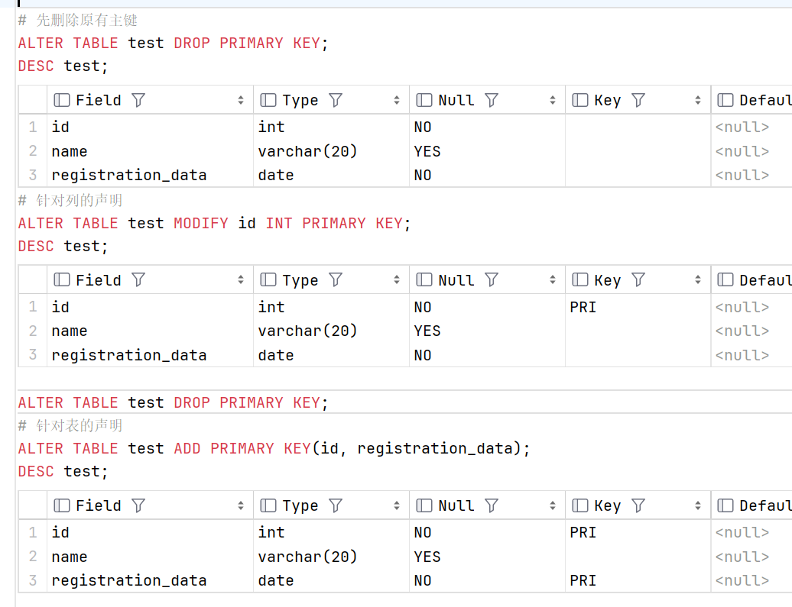

# **数据库完整性**

> 数据的正确性(设计要求)和相容性(一致性); 本章的最后会展示使用数据库完整性约束重构的数据库 game，原始数据库建立参见[第三章](../chapter3/README.md)

### 关于键/码的相关术语

> 候选码、主码简称码

+ 超码/超键 ( super key )：在关系中某一属性能唯一的标识一个元组(表中的一条记录)的称该属性为超键

+ 候选码/候选键 ( candidate key )：当超键中不含有多余属性时称为候选键
    
    > 候选键中的属性称为主属性，不包含在任何候选键中的属性称为非主属性

+ 主码/主键 ( primary key )：用户根据需要选定多个候选键中的一个作为主键

+ 外码/外键 ( foreign key )：如果某属性不是关系 R1 的码，而在另一个关系 R2 中是主键，则该属性是关系模式 R1 的外键，其参照于 R2 的主键

### 实体完整性
        
主键约束：`PRIMARY KEY`

> 限定字段非空且唯一

#### 添加主键：

语法：

```sql
    CREATE TABLE 表名 (字段名1 字段类型1 PRIMARY KEY, 字段名2 字段类型2, ...字段名n 字段类型n);
    CREATE TABLE 表名 (字段名1 字段类型1, 字段名2 字段类型2, ...字段名n 字段类型n, PRIMARY KEY(字段名)); 
```

+ 在创建表时，添加主键约束

```sql
    # 针对列的声明
    DROP TABLE IF EXISTS test;
    CREATE TABLE test (id INT PRIMARY KEY);
    DESC test;
    # 针对表的声明。创建联合主键：PRIMARY KEY (字段名1, 字段名2);
    DROP TABLE test;
    CREATE TABLE test (id INT, name VARCHAR(20), registration_data DATE, PRIMARY KEY(id, registration_data));
    DESC test;
```


+ 创建完表后，添加主键

> 需要注意的是，一个表只能有一个主键，因此只能在没有主键的表中添加主键。

```sql
    # 先删除原有主键 
    ALTER TABLE test DROP PRIMARY KEY;
    DESC test;
    # 针对列的声明
    ALTER TABLE test MODIFY id INT PRIMARY KEY;
    DESC test;
    # 先删除原有主键 
    ALTER TABLE test DROP PRIMARY KEY;
    DESC test;
    # 针对表的声明
    ALTER TABLE test ADD PRIMARY KEY(id, registration_data);
```



#### 删除主键

```sql
    # 和索引不一样的是不需要知道主键名字
    ALTER TABLE test DROP PRIMARY KEY;
    DESC test;
```


### 参照完整性

外键约束  `CONSTRAINT` + `FOREIGN KEY` + `REFERENCES`

> 在创建表时需要注意创建顺序，保证不引用不存在的数据（也就是说对于该属性而言的主表必须先有这个属性的数据，该属性的从表中才能有与之相同的数据）

> 此外，外键约束中，外键列不能是主键，主表列必须是主键或唯一键值

#### 添加外键

语法：

```sql
    CREATE TABLE IF NOT EXIST 表名(所有字段名声明及主键声明, CONSTRAINT [外键名] FOREIGN KEY (外键列名称) REFERENCES 主表名(主表字段名));
    ALTER TABLE 表名 ADD CONSTRAINT [外键名] FOREIGN KEY (外键列名称) REFERENCES 主表名(主表字段名);
```

+ 在创建表时添加外键

```sql
    DROP TABLE IF EXISTS test;
    DROP TABLE IF EXISTS record;
    CREATE TABLE test(
        id INT,
        name VARCHAR(20),
        registration_date DATE,
        PRIMARY KEY (id)
    );
    CREATE TABLE record(
        r_id INT,
        r_name VARCHAR(20),
        CONSTRAINT FOREIGN KEY (r_id) REFERENCES test(id)
    );
    # 系统会自动给外键一个名称
    SELECT * FROM information_schema.KEY_COLUMN_USAGE WHERE REFERENCED_TABLE_NAME='test';
```


+ 创建表之后添加外键

```sql
    ALTER TABLE test ADD UNIQUE(name);
    ALTER TABLE record ADD CONSTRAINT 名字依赖  FOREIGN KEY (r_name) REFERENCES test(name);
    SELECT * FROM information_schema.KEY_COLUMN_USAGE WHERE REFERENCED_TABLE_NAME='test';
```


#### 删除外键

```sql
    # 也可以通过查看数据库创建语句查看外键名
    SHOW CREATE TABLE record;
    ALTER TABLE record DROP FOREIGN KEY record_ibfk_1;
    ALTER TABLE record DROP FOREIGN KEY 名字依赖;
    SELECT * FROM information_schema.KEY_COLUMN_USAGE WHERE REFERENCED_TABLE_NAME='test';
```


但是由于 MySQL 在创建外键后还会自动创建一个索引, 因此还需要删除索引

```sql
    ALTER TABLE record DROP KEY r_id;
    ALTER TABLE record DROP KEY 名字依赖;
```

#### 外键约束的参照操作

父表中更新、删除数据时外键的应对

语法：

```sql
    ALTER TABLE 表名 ADD CONSTRAINT 外键名 FOREIGN KEY (外键列名称) REFERENCES 主表名(主表字段名) ON UPDATE CASCADE ON DELETE CASCADE;
```

+ `CASCADE`：从父表删除或更新且自动删除或更新子表中匹配的行。

+ `SET NULL`：从父表删除或更新行，并设置子表中的外键列为 NULL。--- 如果使用该选项，必须保证子表列没有指定 NOT NULL。

+ `RESTRICT`：拒绝对父表的删除或更新操作，有对应的外键则报错。。---默认

+ `NO ACTION`：标准 SQL 的关键字，在 MySQL 中与 RESTRICT 相同。

示例：

```sql
    ALTER TABLE record ADD CONSTRAINT record_id FOREIGN KEY (r_id) REFERENCES test(id)
        ON
            UPDATE CASCADE
        ON
            DELETE RESTRICT;

    INSERT INTO test (id, name)
    VALUES
        (1, '小白'),
        (2, '小黑'),
        (3, '小红'),
        (4, '小蓝');

    INSERT INTO record (r_id, r_name)
    VALUES
        (1, '小明'),
        (1, '小李'),
        (2, '小张'),
        (2, '小漆');
    SELECT * FROM record;

    UPDATE test SET id = 5 WHERE name = '小黑';
    SELECT * FROM record;
    DELETE FROM test WHERE name = '小白';
    SELECT * FROM record;
```


可以看到 UPDATE 能够正常运行————当主表数据更新，从表也修改对应行；而当对外键所依赖的主表列进行 DELETE 操作时，外键约束会阻止删除操作，因为我们使用了 RESTRICT 关键字来拒绝该操作。

### 用户自定义完整性

> 可在创建和修改表时添加

#### 非空约束 `NOT NULL`

限制字段内容不能为空值

语法：

```sql
    CREATE TABLE IF NOT EXISTS 表名 (字段名 字段类型 NOT NULL);
    ALTER TABLE 表名 MODIFY 字段名 字段类型 NOT NULL;
    ALTER TABLE 表名 MODIFY 字段名 字段类型;
```

#### 唯一约束 `UNIQUE`

限定字段不能有重复（但允许为NULL）

语法：

```sql
    ALTER TABLE 表名 MODIFY 字段名 字段类型 UNIQUE;
    ALTER TABLE 表名 ADD CONSTRAINT 字段名 字段类型(约束别名) ;
    ALTER TABLE 表名 DROP INDEX 字段名/(约束别名);
```

#### 默认值约束 `DEFAULT`

给字段设定一个默认值

#### 自动增长 `AUTO_INCREMENT`

实现数值的自动增长

#### 检查约束 `CHECK`

MySQL 不支持


