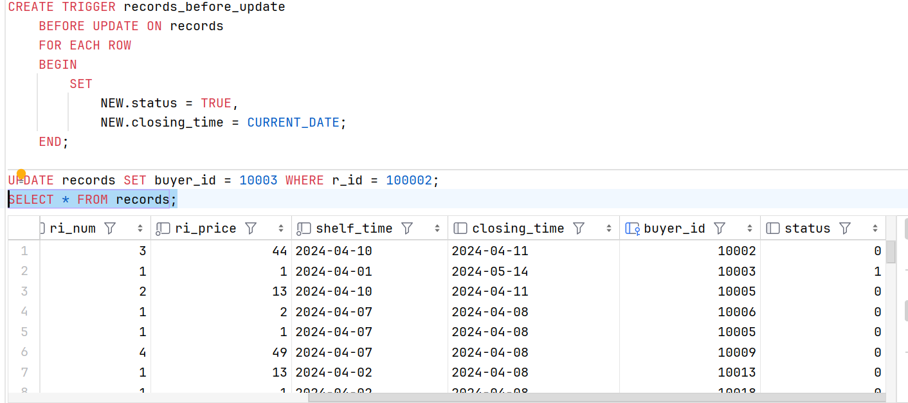
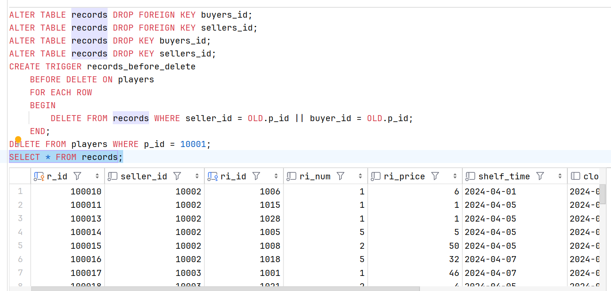

# **触发器**

在上一章中我们介绍了实体完整性，参照完整性以及用户自定义完整性的相关知识，这三者一般称为数据库的完整性约束机制 ( CONSTRAINT )，是数据库实现业务规则和数据完整性的方法之一，但是完整性约束机制只能在用户违反约束机制后做出简单的响应，如果要对用户操作进行更复杂的响应，就需要用到触发器。

触发器是用编程的方法，灵活地实现业务规则并保障数据完整性。**触发器是一种特殊的存储过程**，存储过程需要人为手动调用，而触发器则不需要，它可以在执行某项数据操作后自动触发。

> 百度百科: **触发器与存储过程的唯一区别是触发器不能执行 `EXECUTE` 语句调用，而是在用户执行 `Transact-SQL` 语句时自动触发执行**

### 触发器的类型

按照触发时间和业务类型，MySQL 支持三种类型的触发器：

+ BEFORE 触发器：在执行实际的**数据操作之前**触发，例如在插入、更新或删除数据之前执行某些操作，例如数据验证、数据转换等。

+ AFTER 触发器：在执行实际的**数据操作之后**触发，例如在插入、更新或删除数据之后执行某些操作，例如生成审计日志、更新相关数据等。

+ INSTEAD OF 触发器：在执行实际的**数据操作之前**触发，并可以在触发器中**替代原始的数据操作**，例如在插入、更新或删除数据之前**执行自定义的数据操作**，而不是执行原始的数据操作。

按照操作的类型，MySQL 支持 `INSERT` 、 `UPDATE` 和 `DELETE` 三种触发器。

### 创建触发器

> 基于一个表创建，对多个表进行操作。

#### 语法：

```sql
CREATE TRIGGER trigger_name
[ BEFORE / AFTER ] [ INSERT / UPDATE / DELETE ] ON table_name
FOR EACH ROW
trigger_body
```

其中，

+ trigger_name: 触发器的名称，用户自定义的唯一名称。

+ BEFORE / AFTER: 触发器的触发时机，可以是 BEFORE（在事件之前触发）或 AFTER（在事件之后触发）。

+ [ INSERT / UPDATE / DELETE ]: 触发器所监听的事件，可以是 INSERT（插入操作）、UPDATE（更新操作）或 DELETE（删除操作）。

+ table_name: 触发器所关联的数据库表名。

+ FOR EACH ROW: 表示触发器的作用范围是每一行，即每当表中的一行数据发生指定的事件时，触发器都会被触发。

+ trigger_body: 触发器的执行体，包含一系列的 SQL 语句，用于定义触发器在触发时所执行的操作。

#### 示例：

在先前提到的 game 数据库中，records 表还可以添加 status 列，用来记录每一条记录的状态，默认为 0，表示还没有成交的状态。我们可以用 INSERT 触发器和 UPDATE 触发器来维护 status 列的值()

> 需要注意的是，同表更新不能使用 `UPDATE` 和 `INSERT` 来进行触发操作，避免递归触发

> 需要注意的是，在 AFTER 触发器中，NEW 的赋值已经结束了，只能读取内容，因此只能在BEFORE 触发器中修改 NEW 的值。

```sql
#  当然直接将 status 列的值默认设置为 0 是一个更好的选择
DROP TABLE records;
# CREATE TABLE records(..);( 省略，参见上一章节末尾的[代码](./code/game.sql))
ALTER TABLE records ADD status TINYINT(1);
CREATE TRIGGER records_after_insert
BEFORE INSERT ON records
FOR EACH ROW
BEGIN
    SET NEW.status = FALSE;
END;
# INSERT...( 省略，参见上一章节末尾的[代码](./code/game.sql))
SELECT * FROM records;
```


可以看到，在插入数据时，触发器自动将 status 列的值设置为 0。当然，此处并不算是业务逻辑，而是为了演示触发器的使用，业务所面向的插入应该是没有 buyer_id 和 time 等列值的，而是通过触发器或者业务代码来补充这些列的值。

下面展示UPDATE 触发器：

```sql
# 更新数据，这里我们默认更新的是 buyer_id，也就是默认此处业务时交易完成
CREATE TRIGGER records_before_update
    BEFORE UPDATE ON records
    FOR EACH ROW
    BEGIN
        SET
            NEW.status = TRUE,
            NEW.closing_time = CURRENT_DATE;
    END;

UPDATE records SET buyer_id = 10003 WHERE r_id = 100002;
SELECT * FROM records;
```



可以看到，在更新数据后，触发器自动将 status 列的值设置为 1，同时将 closing_time 列的值设置为当前日期。

上面展示的两个触发器都是对自身表进行操作，下面将在 players 表中定义 DELETE 触发器来演示对 records 表的操作：

```sql
# 由于表中存在外键关系，所以需要先删除外键关系，再进行操作
ALTER TABLE records DROP FOREIGN KEY buyers_id;
ALTER TABLE records DROP FOREIGN KEY sellers_id;
ALTER TABLE records DROP KEY buyers_id;
ALTER TABLE records DROP KEY sellers_id;
CREATE TRIGGER players_before_delete
    BEFORE DELETE ON players
    FOR EACH ROW
    BEGIN
        DELETE FROM records WHERE seller_id = OLD.p_id || buyer_id = OLD.p_id;
    END;
DELETE FROM players WHERE p_id = 10001;
SELECT * FROM records;
```

> 已经更正为 `player_before_delete`



可以看到，删除了 id 为 10001 的玩家后，records 表中的数据也相应被删除了。

### 查看触发器

#### 语法

```sql
    SHOW TRIGGERS [LIKE 'pattern' | WHERE expr];
```

+ `LIKE 'pattern'` 是可选的，表示根据模式匹配来筛选要查看的触发器.

    > pattern 是一个字符串模式，可以包含通配符 % 表示任意字符序列，可以帮助用户根据触发器名称进行模糊匹配。

+ `WHERE expr` 也是可选的，表示根据表达式来筛选要查看的触发器.

    > expr 是一个布尔表达式，用于筛选符合条件的触发器。

#### 示例

在上面的示例中，我们创建了三个触发器，分别是 `records_after_insert`、`records_before_update` 和 `players_before_delete`。我们可以使用 `SHOW TRIGGERS` 命令来查看这些触发器的定义：

```sql
SHOW TRIGGERS;
# 使用 LIKE 模糊查询
SHOW TRIGGERS LIKE 'records%';
```


### 删除触发器

#### 语法 

```sql
DROP TRIGGER [IF EXISTS] [schema_name.]trigger_name;
```

其中:

+ `[IF EXISTS]` 可选，表示在删除触发器时是否检查触发器是否存在，如果存在则删除，如果不存在则忽略。

+ `schema_name` 是可选的，表示触发器所属的数据库模式（Schema）名称，如果省略则表示当前数据库模式。

+ `trigger_name` 是触发器的名称，表示要删除的触发器的名称。

#### 示例

删除之前创建的触发器

```sql
DROP TRIGGER IF EXISTS records_after_insert;
DROP TRIGGER IF EXISTS records_before_update;
DROP TRIGGER IF EXISTS players_before_delete;
SHOW TRIGGERS;
```


