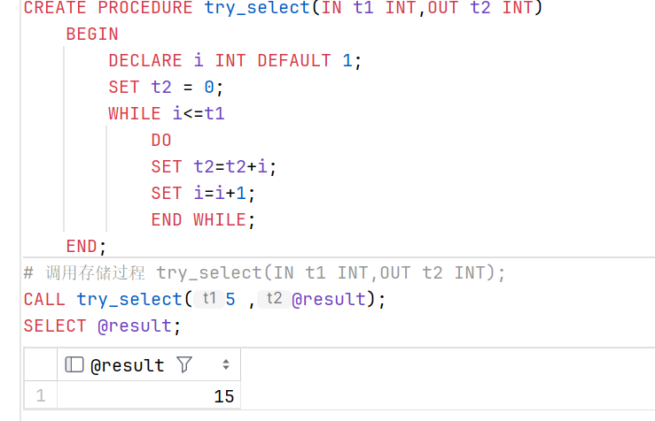
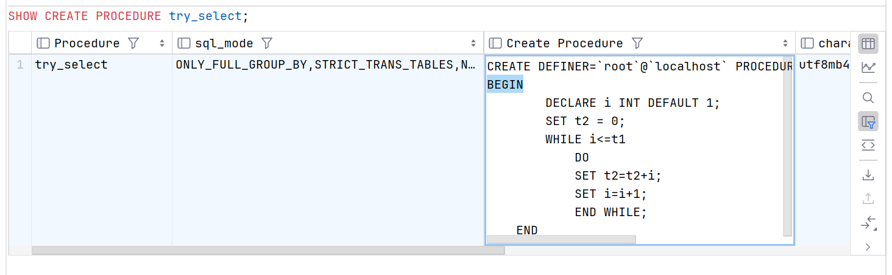
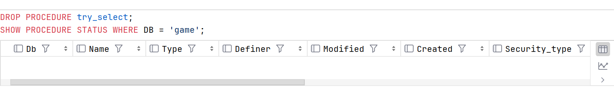

# **存储过程**

MySQL 5.0 版本开始支持存储过程。

存储过程（Stored Procedure）是一种在数据库中存储复杂程序，以便外部程序调用的一种数据库对象。

存储过程思想上很简单，就是数据库 SQL 语言层面的代码封装与重用，类似于 C/C++ 的函数调用。

#### 存储过程的优点： 

+ 通过把处理封装在容易使用的单元中，简化复杂的操作；

+ 简化对变动的管理。如果表名、列名或业务逻辑有变化，只需要更改存储过程的代码，使用它的人员不会改自己的代码；

+ 通常存储过程有助于提高应用程序的性能。当创建的存储过程被编译之后，就存储在数据库中。 但是，MySQL 实现的存储过程略有不同。MySQL 存储过程按需编译。在编译存储过程之后，MySQL 将其放入缓存中。MySQL 为每个连接维护自己的存储过程高速缓存。如果应用程序在单个连接中多次使用存储过程，则使用编译版本，否则存储过程的工作方式类似于查询；

+ 存储过程有助于减少应用程序和数据库服务器之间的流量，因为应用程序不必发送多个冗长的 SQL 语句，而只用发送存储过程的名称和参数；

+ 存储过程对任何应用程序都是可重用的和透明的。存储过程将数据库接口暴露给所有应用程序，以便开发人员不必开发存储过程中已支持的功能；

+ 存储过程是安全的。数据库管理员可以向访问数据库中存储过程的应用程序授予适当的权限，而不向基础数据库表提供任何权限。

#### 存储过程的缺点

+ 如果使用大量存储过程，那么使用这些存储过程的每个连接的内存使用量将会大大增加。 此外，如果您在存储过程中过度使用大量逻辑操作，则 CPU 使用率也会增加，因为 MySQL 数据库最初的设计侧重于高效的查询，不利于逻辑运算；

+ 存储过程的构造使得开发具有复杂业务逻辑的存储过程变得更加困难；
    
+ 很难调试存储过程。只有少数数据库管理系统允许您调试存储过程。不幸的是，MySQL 不提供调试存储过程的功能；

+ 开发和维护存储过程并不容易。开发和维护存储过程通常需要一个不是所有应用程序开发人员拥有的专业技能。这可能会导致应用程序开发和维护阶段的问题

### 存储过程的使用流程

创建存储过程 —— 调用存储过程 —— 显示流程结果

#### 语法

```sql
    # 创建存储过程
    CREATE PROCEDURE 存储过程名( 参数类型 变量名 变量类型, ... )
	BEGIN
		[DECLARE 变量名 类型 [DEFAULT 值];]
		存储过程的语句块;
	END;
    # 调用存储过程，@result 为存储过程返回值也就是 OUT 参数返回的值
    CALL 存储过程名(参数列表, @result);
    # 显示流程结果
    SELECT @result;
```

存储过程中的参数分别有 in，out，inout 三种类型:

+ in 代表输入参数（默认情况下为 in 参数），表示该参数的值必须由调用程序指定。

+ out 代表输出参数，表示该参数的值经存储过程计算后，将 out 参数的计算结果返回给调用程序。

+ inout 代表即时输入参数，又是输出参数，表示该参数的值即可有调用程序制定，又可以将 inout 参数的计算结果返回给调用程序。

DECLARE 中用来声明变量，变量默认赋值使用的 DEFAULT，语句块中改变变量值，使用 SET 变量=值；

#### 示例

```sql
    CREATE PROCEDURE try_select(IN t1 INT,OUT t2 INT)
        BEGIN
            DECLARE i INT DEFAULT 1;
            SET t2 = 0;
            WHILE i <= t1
                DO
                SET t2 = t2 + i;
                SET i = i + 1;
                END WHILE;
        END;
    # 调用存储过程 try_select(IN t1 INT,OUT t2 INT);
    CALL try_select(5 ,@result);
    SELECT @result;
```



### 存储过程的管理

+ 查看存储过程

```sql
    SHOW PROCEDURE STATUS;
    # 查看特定数据库的存储过程
    SHOW PROCEDURE STATUS WHERE DB = 'game';
    # 查看特定名存储过程
    SHOW PROCEDURE STATUS WHERE name LIKE 'ps%';
```


+ 显示存储过程创建代码

```sql
    SHOW CREATE PROCEDURE try_select;
```



+ 删除存储过程

```sql
    DROP PROCEDURE try_select;
    SHOW PROCEDURE STATUS WHERE DB = 'game';
```




