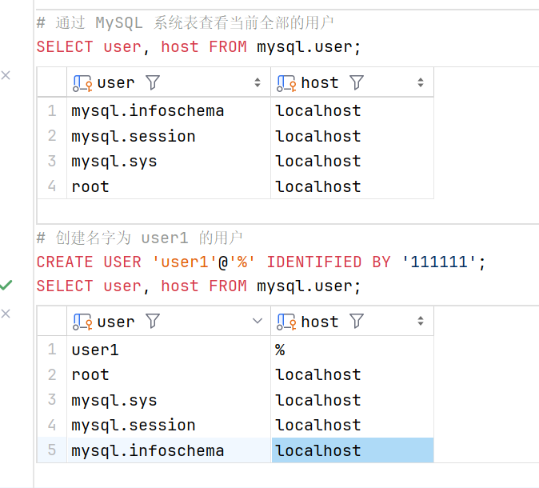
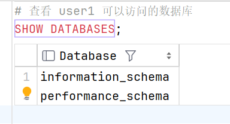
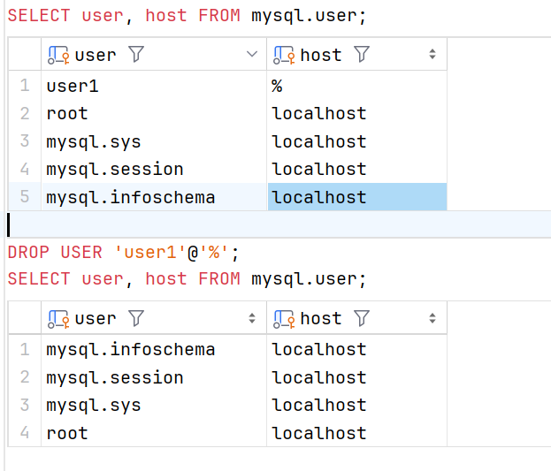
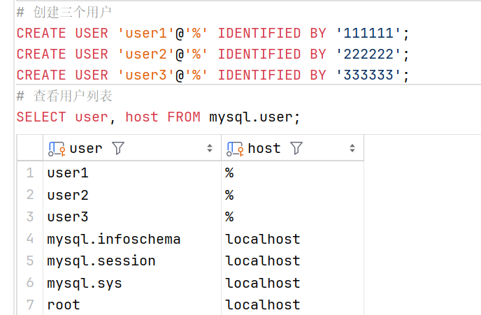
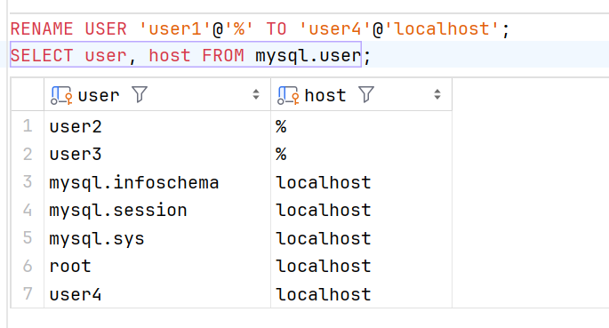

# 用户管理

用户是 MySQL 认证的基本元素。您只能通过正确的用户名和密码登录进入 MySQL 数据库，然后授予用户不同的权限，以便让不同的用户可以进行不同的操作。

### 创建用户

创建用户是精确控制权限的第一步。在 MySQL 中，可以使用 CREATE USER 语句在数据库服务器中创建一个新用户。

#### 语法

```sql
    CREATE USER [IF NOT EXISTS] user_name[@host_name] 
    IDENTIFIED BY 'password';
```

其中：

+ user_name@host_name : 用户名和从该用户连接到 MySQL 服务器的主机名

    如果 username 和 hostname 中包含空格或 - 等特殊字符，则需要将用户名和主机名分别按如下方式引用：

    ```sql
        # 除了单引号 (')，还可以使用反引号 (``) 或双引号 (")。
        'user_name'@'host_name'
    ```

    > @host_name 是可选的，如果省略，则表示用户可以从任何主机连接，也等效于使用 @%。
 
 + IDENTIFIED BY 'password' : 指定用户密码

需要注意的是，`CREATE USER` 语句创建的用户默认是没有权限的，要授予权限请参看[下一章](5-2.md)，使用 `GRANT` 语句来授予用户权限。

#### 示例

使用 root 用户登录到 MySQL 服务器，然后创建一个用户：

> 由于这里使用的是 DataGrip 工具，登录操作可以不需要，我们直接创建用户

```sql
    # 通过 MySQL 系统表查看当前全部的用户
    SELECT user, host FROM mysql.user;
    # 创建名字为 user1 的用户
    CREATE USER 'user1'@'%' IDENTIFIED BY '111111';
    SELECT user, host FROM mysql.user;
```



可以看到，创建用户后，系统表 mysql.user 中多了一个 user1 的用户。

现在我们使用 user1 用户登录到 MySQL 服务器，查看其可访问的数据库列表

> 在 DataGrip 中，在左侧的数据库资源管理器中点击 `+` 号，选中数据源，找到 MySQL 按照下图设置并应用。


在 user1 登录的数据源中打开 console 窗口，输入 `SHOW DATABASES;` 命令，查看 user1 可访问的数据库列表。

```sql
    # 查看 user1 可访问的数据库列表
    SHOW DATABASES;
```



### 删除用户

某些特定的场景下，需要删除已有的用户，比如：

+ 此用户账户已经不被使用

+ 此用户账户已经被泄露

要从 MySQL 服务器中删除用户帐户，需要使用 DROP USER 语句

#### 语法

```sql
    DROP USER [IF EXISTS] account_name [,account_name2]...
```

可以一次删除多个账户

> DROP USER 语句不但删除用户帐户，而且从所有授权表中删除用户的所有权限。

#### 示例

我们继续使用 root 用户登录到 MySQL 服务器，删除我们在上一节创建的 user1 用户

```sql
    DROP USER 'user1'@'%';
    SELECT user, host FROM mysql.user;
```



可以看到, user1 用户已经被删除。

#### 杀掉已删除用户的会话

如果删除的用户在删除之前已经登录了一个会话，删除后并不会影响此会话，直到会话结束。这也会会带来危险。

我们可以使用 `SHOW PROCESSLIST;` 语句来查看当前正在运行的会话列表。

```sql
    SHOW PROCESSLIST;
```


如您所见，用户帐户 user1@localhost 会话仍然存在，其 ID 为 55。我们可以使用使用 KILL 语句终止会话 55：

```sql
    KILL 55;
    SHOW PROCESSLIST;
```


### 用户重命名

某些特定的场景下，需要重命名已有的用户，比如：

+ 此用户账户已经被泄露

+ 将用户名改为一个更有意义的用户名

要从 MySQL 服务器中重命名一个或者多个已有的用户账户，需要使用 RENAME USER 语句。

#### 语法

```sql
    RENAME USER
    user_account TO new_user_account
    [, user_account2 TO new_user_account2]
    [, ...];
```

其中：

+ 在 TO 关键字之前指定要重命名的现有用户账户。

+ 在 TO 关键字之后指定新用户账户。

> 不能使用一个已有的用户账户名作为新的用户账户名

##### 注意事项

`RENAME USER` 将旧用户的所有权限转移给新用户。但是，它不会删除或使依赖于旧用户的数据库对象无效。

例如，假设您有一个存储过程，其 `DEFINER` 属性指定了旧用户。这个存储过程在定义者安全上下文中执行。如果重命名旧用户，则执行存储过程时会出现错误。

#### 示例

```sql
    # 创建三个用户
    CREATE USER 'user1'@'%' IDENTIFIED BY '111111';
    CREATE USER 'user2'@'%' IDENTIFIED BY '222222';
    CREATE USER 'user3'@'%' IDENTIFIED BY '333333';
    # 查看用户列表
    SELECT user, host FROM mysql.user;
```



使用 RENAME USER 语句将 `user1`@`%` 重命名为 `user4`@`%`

```sql
    RENAME USER 'user1'@'%' TO 'user4'@'%';
    SELECT user, host FROM mysql.user;
```




### 修改用户密码