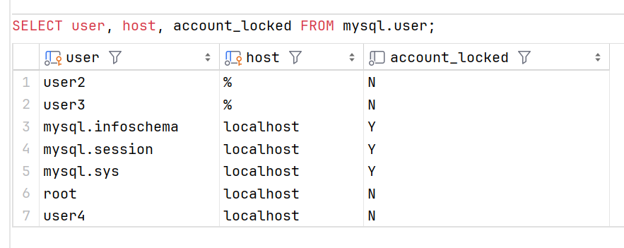

# 用户管理进阶

### 锁定用户账户

某些特定的场景下，需要锁定一个用户账户，比如：

+ 创建一个锁定的用户，等授权完成后再解锁

+ 此用户账户已经不被使用

+ 此用户账户已经被泄露

+ 此用户只是临时使用，使用完成后将用户锁定

要锁定一个已经存在的用户，使用 `ALTER USER .. ACCOUNT LOCK` 语句。

要直接创建一个锁定的用户，使用 `CREATE USER .. ACCOUNT LOCK` 语句。

#### 查询用户的锁定状态

可以在 mysql 数据库中的 user 表中查看用户的锁定状态。mysql.user 表中的 account_locked 列中保存了帐户是否被锁定的状态： Y 指示了此用户被锁定， N 指示了此用户未锁定

```sql
    SELECT user, host, account_locked FROM mysql.user;
```



#### 锁定现有的用户

```sql

```


