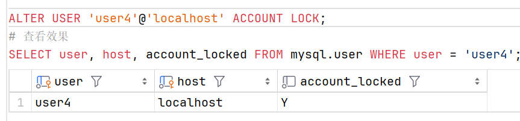
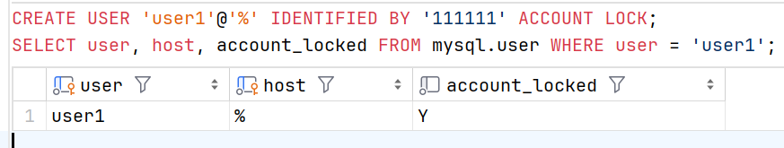
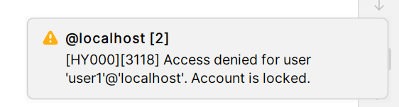

# 用户管理进阶

### 锁定用户账户

某些特定的场景下，需要锁定一个用户账户，比如：

+ 创建一个锁定的用户，等授权完成后再解锁

+ 此用户账户已经不被使用

+ 此用户账户已经被泄露

+ 此用户只是临时使用，使用完成后将用户锁定

要锁定一个已经存在的用户，使用 `ALTER USER .. ACCOUNT LOCK` 语句。

要直接创建一个锁定的用户，使用 `CREATE USER .. ACCOUNT LOCK` 语句。

#### 查询用户的锁定状态

可以在 mysql 数据库中的 user 表中查看用户的锁定状态。mysql.user 表中的 account_locked 列中保存了帐户是否被锁定的状态： Y 指示了此用户被锁定， N 指示了此用户未锁定

```sql
    SELECT user, host, account_locked FROM mysql.user;
```


#### 锁定现有的用户

```sql
    ALTER USER 'user4'@'localhost' ACCOUNT LOCK;
    # 查看效果
    SELECT user, host, account_locked FROM mysql.user WHERE user = 'user4';
```



可以看到用户 user4 已经被锁定，现在使用 user4 登录会被 MySQL 拒绝访问。

#### 创建锁定的用户

```sql
    CREATE USER 'user1'@'%' IDENTIFIED BY '111111' ACCOUNT LOCK;
    SELECT user, host, account_locked FROM mysql.user WHERE user = 'user1';
```



可以看到我们直接创建了一个锁定的用户，它无法进行登录

#### 查看锁定用户的连接次数

MySQL 维护了一个变量 Locked_connects，它用来保存锁定的用户尝试连接到服务器的次数。当锁定的帐户尝试登录时，Locked_connects 变量的值将加 1。

```sql
    SHOW GLOBAL STATUS LIKE 'Locked_connects';
    # 我们使用 user1 尝试登录一次
    SHOW GLOBAL STATUS LIKE 'Locked_connects';
```

在 DataGrip 中添加数据源时选择用户就相当于自动执行登录操作，所以我们使用 user1 尝试登录一次，此时 Locked_connects 变量的值会加 1 ，我们的登陆操作也被拒绝




### 解锁用户账户

要解锁一个或多个锁定的用户，使用 ALTER USER .. ACCOUNT UNLOCK 语句。

#### 语法

```sql
    ALTER USER [IF EXISTS] user@host [, user@host, ...] ACCOUNT UNLOCK;
```

其实和先前锁定用户类似。

#### 示例

解锁 user1 账户

```sql
    ALTER USER 'user1'@'%' ACCOUNT UNLOCK;
    SELECT user, host, account_locked FROM mysql.user WHERE user = 'user1';
```

