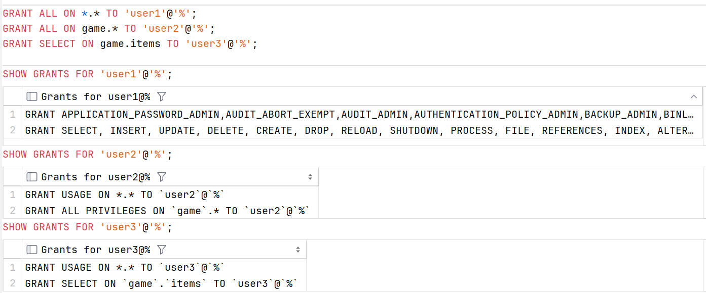
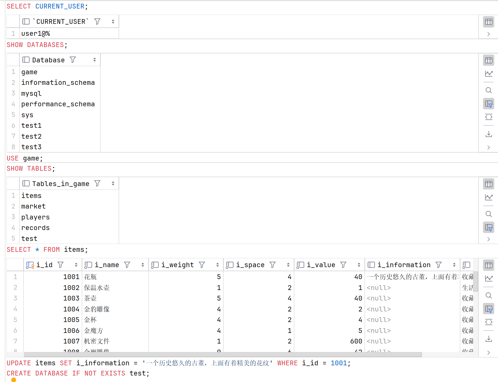
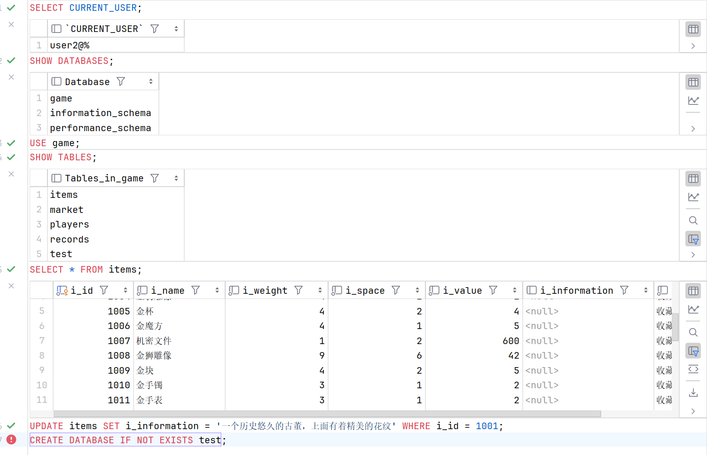

# 权限管理

作为一个数据库管理员或者维护人员，为了数据库的安全性，我们需要更精确的权限控制————授予不同的用户不同的权限，并在合适的时机回收权限（撤销授权）。

### 用户授权

当我们创建了一个新用户 ( 没有锁定 ) 之后，这个新的用户可以登录 MySQL 数据库服务器，但是他没有任何权限 ( 只有一些基本的权限 )。只有在赋予他数据库和相关表的权限之后，他才可以进行选择数据库和查询等操作。

在 MySQL 中，我们使用 `GRANT` 语句用于给用户赋予权限。

#### 语法 

```sql
    GRANT privilege_type [, privilege_type, ...] ON privilege_object TO  'user'@'host';
```

其中：

+ privilege_type：表示权限类型，可以是一个或多个。

    > 常用的如：ALL、SELECT、INSERT、UPDATE、DELETE、DROP、ALTER 等。完整的权限列表参见 [MySQL 8.0 官网说明](https://dev.mysql.com/doc/refman/8.0/en/privileges-provided.html#priv_all)

+ privilege_object：表示权限对象，可以是所有对象，也可以是摸个数据库中的对象，表等。

    ```sql
        # 分配全局权限，全部数据库全部对象的权限
        GRANT ALL ON *.* TO 'user'@'host';
        # 分配数据库全部对象权限
        GRANT ALL ON db_name.* TO 'user'@'host';
        # 分配表权限 SELECT
        GRANT SELECT ON db_name.tb_name TO 'user'@'host';
    ```

#### 示例

我们为 user1， user2，user3 分别赋予不同的权限。并使用 SHOW GRANTS 查看权限。

```sql
    GRANT ALL ON *.* TO 'user1'@'%';
    GRANT ALL ON game.* TO 'user2'@'%';
    GRANT SELECT ON game.items TO 'user3'@'%';

    SHOW GRANTS FOR 'user1'@'%';
    SHOW GRANTS FOR 'user2'@'%';
    SHOW GRANTS FOR 'user3'@'%';
```



现在，分别登入这三个账户，执行下列语句

```sql
    SELECT CURRENT_USER;
    SHOW DATABASES;
    USE game;
    SHOW TABLES;
    SELECT * FROM items;
    UPDATE items SET i_information = '一个历史悠久的古董，上面有着精美的花纹' WHERE i_id = 1001;
    CREATE DATABASE IF NOT EXISTS test;
```

user1 具有全局权限，可以看到全部数据库对象，并具有全局下数据库权限。



user2 具有数据库 game 权限，可以看到 game 数据库和默认的两个数据库，并具有 game 数据库下的全部权限，但是不具有全局下数据库权限，因此在创建数据库时报错。



user3 具有数据库 game 下表 items 的 SELECT 权限，只能看到 game 数据库下的 items 表，只具有 items 表的 SELECT 权限，不具有其他权限，因此在更新数据和创建数据库时都报错。


### 撤销授权

如果面临以下的问题，我们需要撤销用户的权限：

+ 授予了用户错误的权限

+ 授权到期

MySQL 允许使用 REVOKE 语句撤销授予用户的权限。
