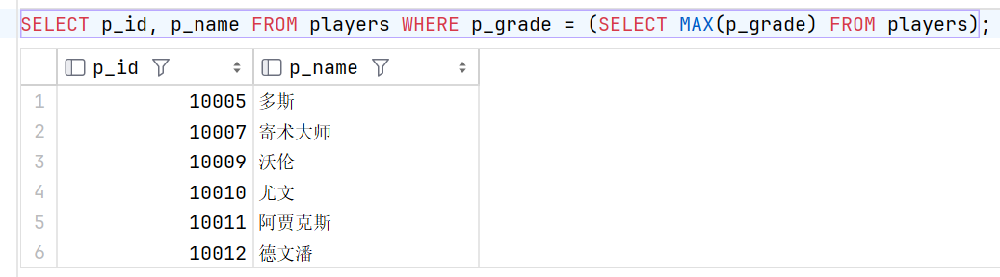
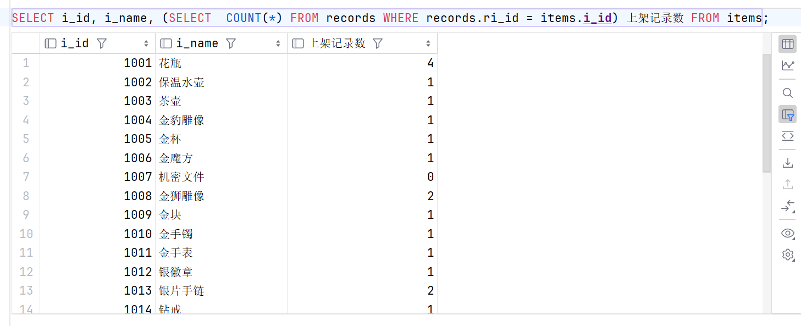
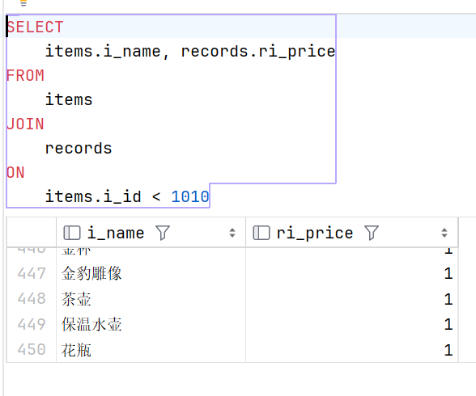
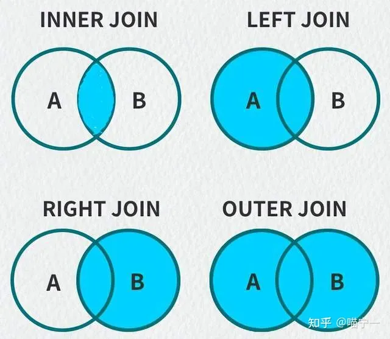
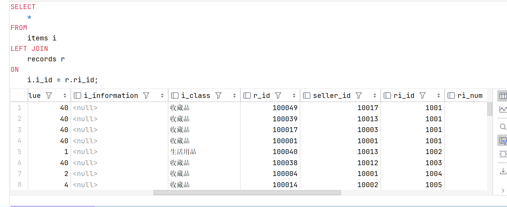
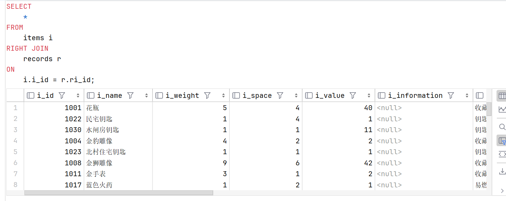

# **3.4 复杂查询**

### 子查询，把一个查询嵌套在另一个查询中 ( 单表查询 )

> 将两条相关的语句合并成一个语句，建立父子继承关系，将父亲运算的返回值作为参数传递给儿子的运算或者筛选条件
    
+ #### 不相关子查询

父查询作为查询条件，把父亲的返回值用于子查询 `WHERE` 语句中

```sql
SELECT p_id, p_name FROM players WHERE p_grade = (SELECT MAX(p_grade) FROM players);
```



+ #### 相关子查询

父查询作为计算字段，根据父亲的返回值计算子查询结果

```sql
SELECT i_id, i_name, (SELECT  COUNT(*) FROM records WHERE records.ri_id = items.i_id) 上架记录数 FROM items;
```



### 多表查询

> 在本章中不考虑对性能的优化，索引、主键、优化策略会在后续章节中介绍

+ #### 笛卡尔积现象：两张表没有任何条件限制进行连接查询，最终查询结果条数等于两表条数乘积

    **<center>A × B</center>**

    + 无匹配条件和筛选条件，最终查询结果条数等于两表条数乘积

    ```sql
    # 在这里我们可以看到会出现 1500 条查询记录( 30 * 50 )
    # 这也叫做隐式交叉连接（笛卡尔积）
    SELECT
        items.i_name, records.ri_price
    FROM
        items, records;
    /*
    # 等价于
    SELECT 
        items.i_name, records.ri_price
    FROM
        items
    CROSS JOIN
        records
    */
    ```

    

    + 添加匹配条件（只改变显示结果，实际效率未提高，）

    ```sql
    SELECT
        items.i_name, records.ri_price
    FROM
        items, records
    WHERE
        items.i_id = records.ri_id;
    ```

    

    + 在查询时添加寻找限制（提高查询效率）---减少连接次数

    ```sql
    SELECT
        items.i_name, records.ri_price
    FROM
        items
    JOIN
        records
    ON
        items.i_id < 1010
    ```

    

+ #### 年代分类：

    + ##### SQL92：
        
        结构不清晰，表连接条件和筛选条件都在 `WHERE` 后

    + ##### SQL99：
        
        表连接的条件 `ON` 和筛选条件 `WHERE` 分离

+ #### 连接方式分类：

    

    + ##### 内连接 ( INNER )

        **<center>A ⋈ B</center>**

        + 等值连接 ---条件为等量关系

        ```sql
        SELECT
            items.i_name, records.ri_price
        FROM
            items
        INNER JOIN
            records
        ON
            items.i_id = records.ri_id;
        ```

        

        + 非等值连接 ---条件不是一个等量关系

        ```sql
        SELECT
            i.i_name, r.ri_price
        FROM
            items i
        INNER JOIN
            records r
        ON
            i.i_value < r.ri_price;
        ```

        

        + 自连接 ---一张表看成两张表，通过别名连接

        ```sql
        # 查询哪几天既有上架也有售出
        SELECT DISTINCT
            a.shelf_time
        FROM
            records a
        JOIN
            records b
        ON
            a.shelf_time=b.closing_time;
        ```

        

    + ##### 外连接 ( OUTER ) ---两张表连接产生主次关系，保留主表中不符合连接条件的行信息，对应从表属性为 0

        + 左连接 ---将 `JOIN` 左边当作主表, 主要是为了将这张表的数据全部查询出来 

        ```sql
        # 可以看到明显的以左表为主表，依照左表的 i_id 进行连接(顺序)
        SELECT
            *
        FROM
            items i
        LEFT JOIN
            records r
        ON
            i.i_id = r.ri_id;
        ```

        **<center>A ⋃ A ⋈ B</center>**

        

        + 右连接 ---将 `JOIN` 右边当作主表，主要是为了将这张表的数据全部查询出来
        
        ```sql
        # 可以看到明显的以右表为主表，依照左表的 ri_id 进行连接(顺序)
        SELECT
            *
        FROM
            items i
        RIGHT JOIN
            records r
        ON
            i.i_id = r.ri_id;
        ```

        **<center>A ⋈ B ⋃ B</center>**

        

        + 全连接：a 和 b 都是主表

            > `MySQL` 目前还不支持全连接 `FULL JOIN`, 不过我们可以通过下一章中的 `UNION` 关键字来实现全连接


