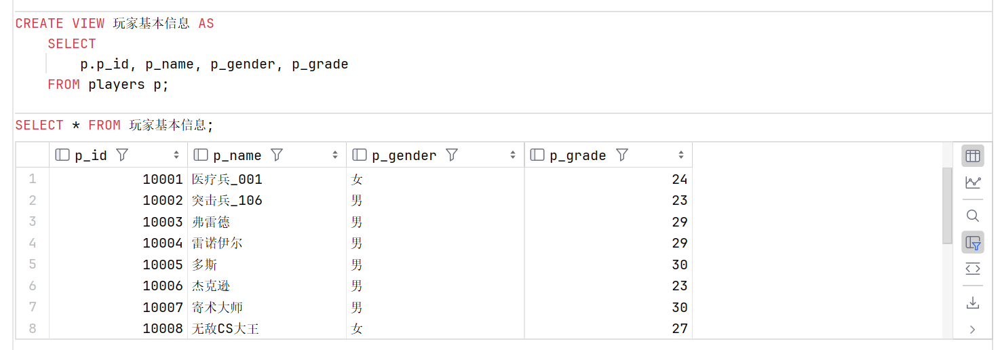
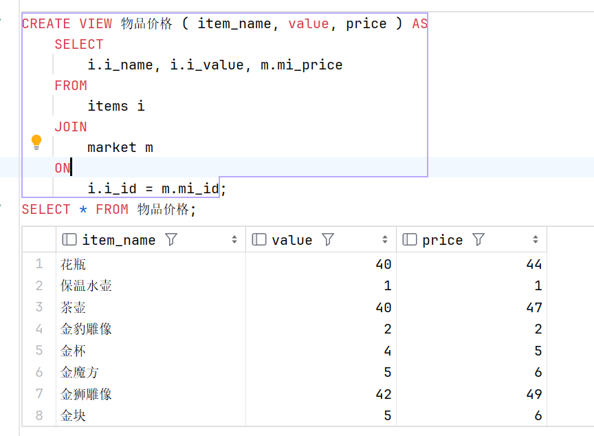
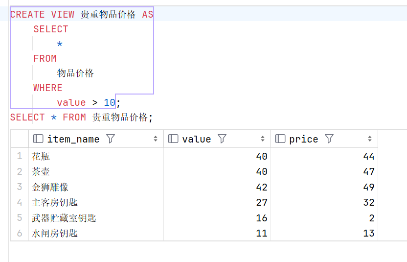
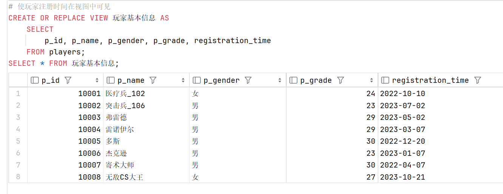
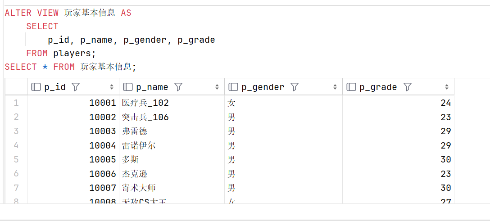
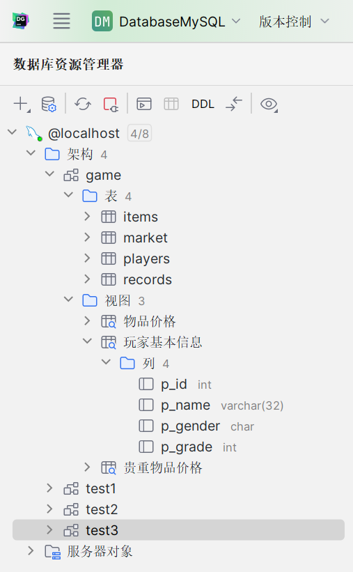

# **视图**

> 实际上是对查询的一种抽象实例，个人感觉视图像是 C++ 中的引用，访问视图就是通过其定义的引用，访问对应列。可以把视图当成一个虚拟表使用。

### 创建视图

#### 语法：

```sql
    CREATE [OR REPLACE] [ALGORITHM = {UNDEFINED | MERGE | TEMPTABLE}] 
    VIEW 视图名称 [(字段列表)] 
    AS 查询语句 [WITH [CASCADED|LOCAL] CHECK OPTION]
```

+ `OR REPLACE`：如果视图已经存在，则先删除再创建

+ `ALGORITHM`：视图的算法，默认为 `UNDEFINED`，可选值为 `MERGE` 和 `TEMPTABLE`

+ `WITH [CASCADED|LOCAL] CHECK OPTION`：视图的 CHECK OPTION，默认为 `CASCADED`，可选值为 `CASCADED` 和 `LOCAL`

    > 该选项的作用是：通过视图插入、删除或修改元组时检查元组是否满足视图定义中的条件，如果不满足将拒绝执行这些操作。

+ 字段列表：视图的字段列表，如果不指定，则默认为查询语句中的字段列表

    > 如果视图定义语句中含有列名表选项，则该选项中的列名个数和次序都要与`SELECT`后的列名表一致。

+ 查询语句：视图的查询语句，必须为 `SELECT` 语句

    > 在视图定义的 `SELECT` 语句中，不能包含 `ORDER BY` 关键字

#### 常见示例

##### 创建视图

+ 单表视图

```sql
    CREATE VIEW 玩家基本信息 AS
        SELECT  
            p_id, p_name, p_gender, p_grade
        FROM players; 
    SELECT * FROM 玩家基本信息;
```



+ 在视图中使用别名

    > 除去在 SELECT 语句中直接使用别名外，还可以使用视图中的别名使用法。

```sql
    # 删去旧视图
    DROP VIEW 玩家基本信息;

    # 指定视图中别名
    CREATE VIEW 玩家基本信息 (id, name, gender, grade) AS
        SELECT
            p.p_id,  p_name, p_gender, p_grade
        FROM players p;

    SELECT * FROM 玩家基本信息;

```


+ 多表视图

```sql
    CREATE VIEW 物品价格 ( item_name, value, price ) AS
        SELECT
            i.i_name, i.i_value, m.mi_price
        FROM 
            items i
        JOIN 
            market m
        ON
            i.i_id = m.mi_id;
    SELECT * FROM 物品价格;
```



+ 基于视图的视图

```sql
    CREATE VIEW 贵重物品价格 AS
        SELECT 
            * 
        FROM 
            物品价格 
        WHERE 
            value > 10;
    SELECT * FROM 贵重物品价格;
```



### 查看视图

正如前面所看到的，视图其实可以当成一张虚拟表进行查看，因此查询方式和正常表一样，参见本章前几节。
 
查看视图的属性信息，会发现除了 `Create_time` 和 `Comment` 外，其他属性都为空，`Comment` 为 `view` 表示该表为视图，是虚表。

```sql
    SHOW TABLE STATUS LIKE '物品价格';
```


### 修改视图

> 类似于 `C++` 中的引用，对视图的修改其实是对视图基表的修改，或者说，因为视图只是虚表，想要修改视图只能对其基表进行修改，因此对视图的修改会作用到其基表上，当然对视图的修改是有限制的，在一些情况下（要使视图可更新，视图中的行和底层基本表中的行之间必须存在一对一的关系），视图不允许修改。


```sql
    # 插入数据和删除等操作也类似于基本表，不过多展示
    UPDATE 玩家基本信息 SET name = '医疗兵_102' WHERE id = 10001;
    SELECT * FROM 玩家基本信息;
```


#### 不支持修改

**当视图定义出现如下情况时，视图不支持修改操作：**

+ 在定义视图的时候指定了 `ALGORITHM = TEMPTABLE`，视图将不支持 `INSERT` 和 `DELETE` 操作；

+ 视图中不包含基表中所有被定义为非空又未指定默认值的列，视图将不支持 `INSERT` 操作；

+ 在定义视图的 `SELECT` 语句中使用了 `JOIN` 联合查询 ，视图将不支持 `INSERT` 和 `DELETE` 操作；

+ 在定义视图的 `SELECT` 语句后的字段列表中使用了 数学表达式 或 子查询 ，视图将不支持 `INSERT`，也不支持 `UPDATE` 使用了数学表达式、子查询的字段值；

+ 在定义视图的 `SELECT` 语句后的字段列表中使用 `DISTINCT` 、 聚合函数 、 `GROUP BY` 、 `HAVING` 、 `UNION` 等，视图将不支持 `INSERT`、`UPDATE`、`DELETE`；

+ 在定义视图的 `SELECT` 语句中包含了子查询，而子查询中引用了 `FROM` 后面的表，视图将不支持 `INSERT`、`UPDATE`、`DELETE`；

+ 视图定义基于一个不可更新视图 ；

+ 常量视图。

### 变更视图

> 好吧，其实就是更新视图 ( 替换视图名字对应的查询语句 )

+ 使用 `CREATE OR REPLACE VIEW` 语句

```sql
    # 使玩家注册时间在视图中可见
    CREATE OR REPLACE VIEW 玩家基本信息 AS
        SELECT  
            p_id, p_name, p_gender, p_grade, registration_time
        FROM players; 
    SELECT * FROM 玩家基本信息;
```



+ 使用 `ALTER VIEW` 语句 ( 两个方法其实一样 )

```sql
    ALTER VIEW 玩家基本信息 AS
        SELECT  
            p_id, p_name, p_gender, p_grade
        FROM players;
    SELECT * FROM 玩家基本信息;
```



### 删除视图

> 只是删除视图的定义，不影响基表

```sql
    DROP VIEW 玩家基本信息;
    DROP VIEW IF EXISTS 物品价格;
    DROP VIEW 贵重物品价格;
```


可以看到之前的视图已经消失了

( 视图未被删除时 )




