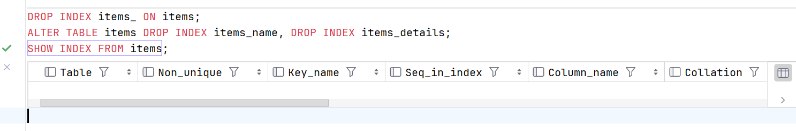
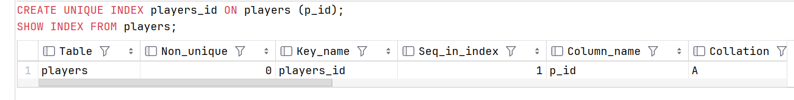
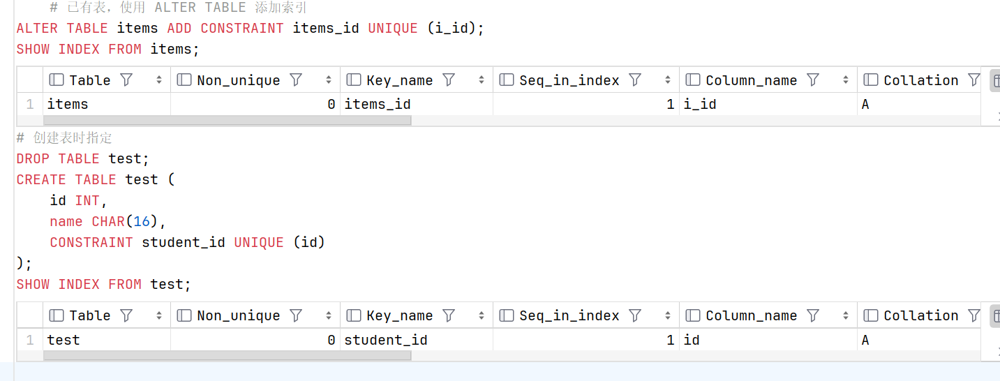

# **索引**

> MySQL 索引是一种数据结构，用于加快数据库查询的速度和性能。  
MySQL 索引类似于书籍的目录，通过存储指向数据行的指针，可以快速定位和访问表中的特定数据。  
形象地讲，不使用索引就好像查字典只能一页一页的阅读内容查找数据，而索引就好像目录一样，可以通过偏旁目录来直接定位到相应的页，从而减少查询时间。

索引分单列索引和组合索引：

+ 单列索引，即一个索引只包含单个列，一个表可以有多个单列索引。

+ 组合索引，即一个索引包含多个列。

索引虽然能够提高查询性能，但也需要注意以下几点：

+ 索引需要占用额外的存储空间

    > 空间换时间，相当于书籍里面的目录页

+ 对表进行插入、更新和删除操作时，索引需要维护，可能会影响性能

+ 过多或不合理的索引可能会导致性能下降，因此需要谨慎选择和规划索引

### 显示索引信息

```sql
SHOW INDEX FROM table_name;
```

执行上述命令后，将会显示指定表中所有索引的详细信息，包括索引名称（Key_name）、索引列（Column_name）、是否是唯一索引（Non_unique）、排序方式（Collation）、索引的基数（Cardinality）等。示例将在后续内容中结合展示。

### 普通索引

普通索引是最常见的索引类型，用于加速对表中数据的查询。

#### 创建索引

##### 语法：

```sql
CREATE INDEX index_name ON table_name (column1 [ASC|DESC], column2 [ASC|DESC], ...);
```

+ CREATE INDEX: 用于创建普通索引的关键字。

+ index_name: 指定要创建的索引的名称。**索引名称在表中必须是唯一的。**

+ table_name: 指定要在哪个表上创建索引。

+ (column1, column2, ...): 指定要索引的表列名，可以指定一个或多个列作为索引的组合。

+ ASC 和 DESC（可选）: 用于指定索引的排序顺序。默认情况下，索引以升序（ASC）排序。

##### 示例

```sql
CREATE INDEX items_name ON items (i_name);
CREATE INDEX items_details ON items (i_weight, i_value DESC, i_space);
# 显示索引信息
SHOW INDEX FROM items;
```


我们可以看到左侧索引下已经创建了两个索引。

#### 添加索引

```sql
# 已有表，使用 ALTER TABLE 添加索引
ALTER TABLE items ADD INDEX items_(i_name, i_value);
#### 创建表时指定
CREATE TABLE test (
    id INT,
    name CHAR(16),
    INDEX student_id (id)
);
```


#### 删除索引

##### 语法

```sql
DROP INDEX index_name ON table_name;
# 或者使用 ALTER TABLE .. DROP INDEX
ALTER TABLE table_name DROP INDEX index_name;
```

##### 示例

```sql
DROP INDEX items_ ON items;
ALTER TABLE items DROP INDEX items_name, DROP INDEX items_details;
SHOW INDEX FROM items;
```



### 唯一索引

唯一索引（UNIQUE INDEX）用于确保表中每行数据的某个字段的值是唯一的，不允许存在重复值。

> 唯一索引时一种约束，因此它和后续章节中完整性约束中所使用的关键字是一样的

#### 创建唯一索引

##### 语法

```sql
CREATE UNIQUE INDEX index_name
ON table_name (column1 [ASC|DESC], column2 [ASC|DESC], ...);
```

##### 示例

```sql
CREATE UNIQUE INDEX players_id ON players (p_id);
SHOW INDEX FROM players;
```



#### 添加索引

> 注意：**使用的是 CONSTRAINT 关键字**

```sql
# 已有表，使用 ALTER TABLE 添加索引
ALTER TABLE items ADD CONSTRAINT items_id UNIQUE (i_id);
SHOW INDEX FROM items;
# 创建表时指定
CREATE TABLE test (
    id INT,
    name CHAR(16),
    CONSTRAINT student_id UNIQUE (id)
);
SHOW INDEX FROM test;
```



#### 删除索引

语法与删除普通索引的语法一样

### 全文索引

全文索引的弊端个人认为较大，当前的数据量也无法展示全文索引的有点，因此此处放置一篇[参考文章的链接](https://www.cnblogs.com/yangyxd/p/15252691.html)