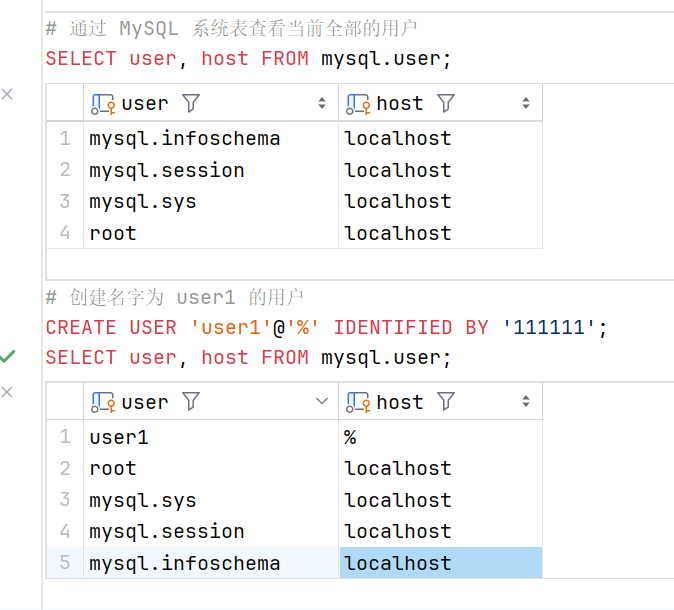
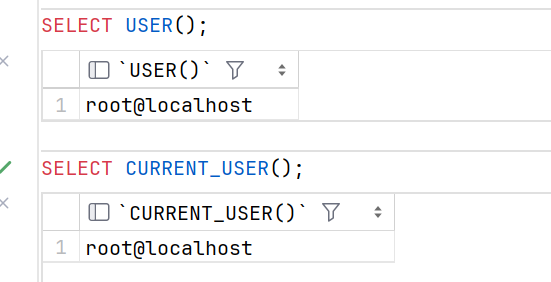

# 用户管理基础

用户是 MySQL 认证的基本元素。您只能通过正确的用户名和密码登录进入 MySQL 数据库，然后授予用户不同的权限，以便让不同的用户可以进行不同的操作。

### 创建用户

创建用户是精确控制权限的第一步。在 MySQL 中，可以使用 CREATE USER 语句在数据库服务器中创建一个新用户。

#### 语法

```sql
CREATE USER [IF NOT EXISTS] user_name[@host_name] 
IDENTIFIED BY 'password';
```

其中：

+ user_name@host_name : 用户名和从该用户连接到 MySQL 服务器的主机名

    如果 username 和 hostname 中包含空格或 - 等特殊字符，则需要将用户名和主机名分别按如下方式引用：

    ```sql
    # 除了单引号 (')，还可以使用反引号 (``) 或双引号 (")。
    'user_name'@'host_name'
    ```

    > @host_name 是可选的，如果省略，则表示用户可以从任何主机连接，也等效于使用 @%
 
+ IDENTIFIED BY 'password' : 指定用户密码

需要注意的是，`CREATE USER` 语句创建的用户默认是没有权限的，要授予权限请参看[下一章](5-2.md)，使用 `GRANT` 语句来授予用户权限。

#### 示例

使用 root 用户登录到 MySQL 服务器，然后创建一个用户：

> 由于这里使用的是 DataGrip 工具，登录操作可以不需要，我们直接创建用户

```sql
# 通过 MySQL 系统表查看当前全部的用户
SELECT user, host FROM mysql.user;
# 创建名字为 user1 的用户
CREATE USER 'user1'@'%' IDENTIFIED BY '111111';
SELECT user, host FROM mysql.user;
```



可以看到，创建用户后，系统表 mysql.user 中多了一个 user1 的用户。

现在我们使用 user1 用户登录到 MySQL 服务器，查看其可访问的数据库列表

> 在 DataGrip 中，在左侧的数据库资源管理器中点击 `+` 号，选中数据源，找到 MySQL 按照下图设置并应用。


在 user1 登录的数据源中打开 console 窗口，输入 `SHOW DATABASES;` 命令，查看 user1 可访问的数据库列表。

```sql
# 查看 user1 可访问的数据库列表
SHOW DATABASES;
```


### 删除用户

某些特定的场景下，需要删除已有的用户，比如：

+ 此用户账户已经不被使用

+ 此用户账户已经被泄露

要从 MySQL 服务器中删除用户帐户，需要使用 DROP USER 语句

#### 语法

```sql
DROP USER [IF EXISTS] account_name [,account_name2]...;
```

可以一次删除多个账户

> DROP USER 语句不但删除用户帐户，而且从所有授权表中删除用户的所有权限。

#### 示例

我们继续使用 root 用户登录到 MySQL 服务器，删除我们在上一节创建的 user1 用户

```sql
DROP USER 'user1'@'%';
SELECT user, host FROM mysql.user;
```


可以看到, user1 用户已经被删除。

#### 杀掉已删除用户的会话

如果删除的用户在删除之前已经登录了一个会话，删除后并不会影响此会话，直到会话结束。这也会会带来危险。

我们可以使用 `SHOW PROCESSLIST;` 语句来查看当前正在运行的会话列表。

```sql
SHOW PROCESSLIST;
```


如您所见，用户帐户 user1@localhost 会话仍然存在，其 ID 为 55。我们可以使用使用 KILL 语句终止会话 55：

```sql
KILL 55;
SHOW PROCESSLIST;
```


### 用户重命名

某些特定的场景下，需要重命名已有的用户，比如：

+ 此用户账户已经被泄露

+ 将用户名改为一个更有意义的用户名

要从 MySQL 服务器中重命名一个或者多个已有的用户账户，需要使用 RENAME USER 语句。

#### 语法

```sql
RENAME USER
user_account TO new_user_account
[, user_account2 TO new_user_account2]
[, ...];
```

其中：

+ 在 TO 关键字之前指定要重命名的现有用户账户。

+ 在 TO 关键字之后指定新用户账户。

> 不能使用一个已有的用户账户名作为新的用户账户名

##### 注意事项

`RENAME USER` 将旧用户的所有权限转移给新用户。但是，它不会删除或使依赖于旧用户的数据库对象无效。

例如，假设您有一个存储过程，其 `DEFINER` 属性指定了旧用户。这个存储过程在定义者安全上下文中执行。如果重命名旧用户，则执行存储过程时会出现错误。

#### 示例

```sql
# 创建三个用户
CREATE USER 'user1'@'%' IDENTIFIED BY '111111';
CREATE USER 'user2'@'%' IDENTIFIED BY '222222';
CREATE USER 'user3'@'%' IDENTIFIED BY '333333';
# 查看用户列表
SELECT user, host FROM mysql.user;
```


使用 RENAME USER 语句将 `user1`@`%` 重命名为 `user4`@`localhost`

```sql
RENAME USER 'user1'@'%' TO 'user4'@'localhost';
SELECT user, host FROM mysql.user;
```


### 修改用户密码

在 MySQL 中，可以使用 UPDATE， SET PASSWORD 和 ALTER USER 语句来更改用户的密码。

> 请注意，从 MySQL 5.7.6 开始，用户表使用列 authentication_string 来存储密码并且删除了 password 列，并且在 MySQL 5.7.9 以后废弃了 PASSWORD() 函数，在 MySQL 8.0 以后版本中，我们使用 ALTER USER 语句来修改密码。

#### 语法

```sql
ALTER USER 'user_name'@'host_name' IDENTIFIED BY 'new_password';
```

#### 示例

```sql
SELECT user, host, authentication_string FROM mysql.user WHERE user = 'user4';
ALTER USER 'user4'@'localhost' IDENTIFIED BY '444444';
FLUSH PRIVILEGES;
SELECT user, host, authentication_string FROM mysql.user WHERE user = 'user4';
```


虽然不是明文，但是还是可以大概看出来密码变了

如果您想重置 MySQL root 帐户的密码，则需要在不使用授权表验证的情况下强制 MySQL 数据库服务器停止并重新启动。

### 查看用户

和查看数据库和数据表不同，查看用户不是使用 `SHOW USERS` 语句，而是通过对表 user 查询

在 mysql.user 表中有很多列，分别保存了用户的各种各样的信息，比如密码，密码有效期，是否锁定 和 各种权限等。

```sql
SELECT user, host FROM mysql.user;
# 查看 mysql.user 表的所有列
DESC mysql.user;
```


#### 显示当前使用的用户

```sql
SELECT USER();
SELECT CURRENT_USER();
```

列出当前登录 MySQL 数据库服务器的所有用户

```sql
SHOW PROCESSLIST;
SELECT user, host, db, command
FROM information_schema.processlist;
```

