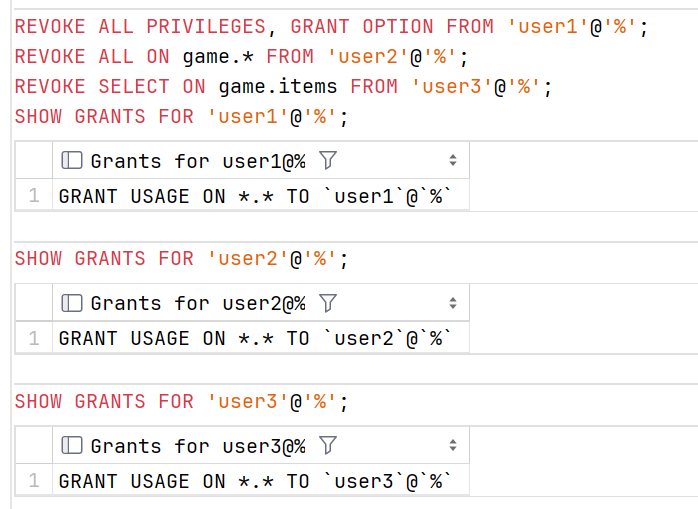
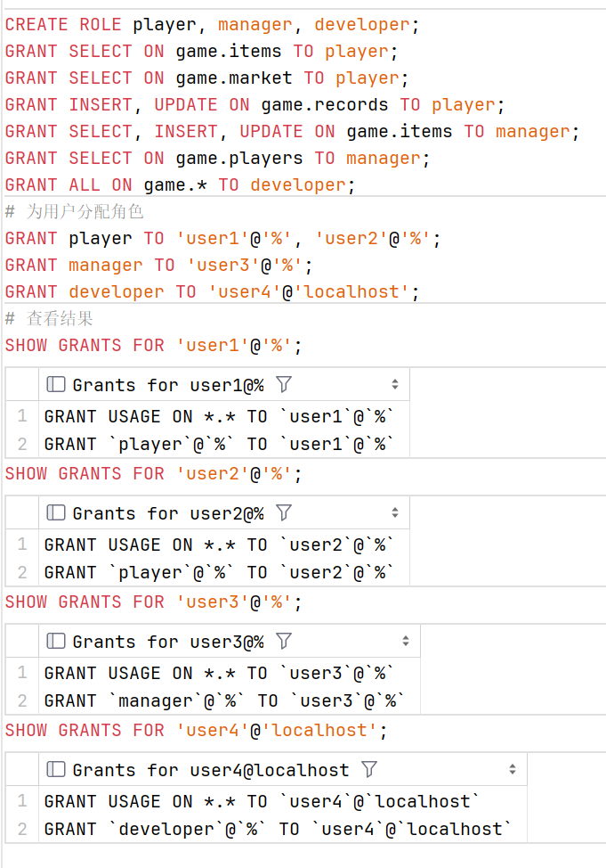
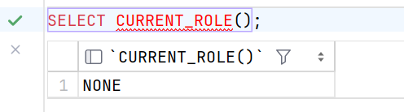
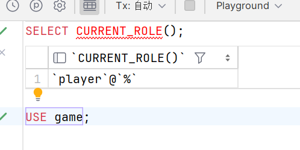
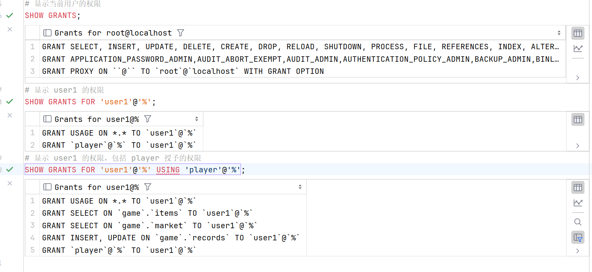

# 权限管理

作为一个数据库管理员或者维护人员，为了数据库的安全性，我们需要更精确的权限控制————授予不同的用户不同的权限，并在合适的时机回收权限（撤销授权）。

### 用户授权

当我们创建了一个新用户 ( 没有锁定 ) 之后，这个新的用户可以登录 MySQL 数据库服务器，但是他没有任何权限 ( 只有一些基本的权限 )。只有在赋予他数据库和相关表的权限之后，他才可以进行选择数据库和查询等操作。

在 MySQL 中，我们使用 `GRANT` 语句用于给用户赋予权限。

#### 语法 

```sql
GRANT privilege_type [, privilege_type, ...] ON privilege_object 
TO  'user'@'host' [IDENTIFIED BY 'password']
[WITH {GRANT OPTION | resource_option}];
```

其中：

+ privilege_type：表示权限类型，可以是一个或多个。

    > 常用的如：ALL、SELECT、INSERT、UPDATE、DELETE、DROP、ALTER 等。完整的权限列表参见 [MySQL 8.0 官网说明](https://dev.mysql.com/doc/refman/8.0/en/privileges-provided.html#priv_all)

+ privilege_object：表示权限对象，可以是所有对象，也可以是摸个数据库中的对象，表等。

    ```sql
    # 分配全局权限，全部数据库全部对象的权限
    GRANT ALL ON *.* TO 'user'@'host';
    # 分配数据库全部对象权限
    GRANT ALL ON db_name.* TO 'user'@'host';
    # 分配表权限 SELECT
    GRANT SELECT ON db_name.tb_name TO 'user'@'host';
    ```

+ IDENTIFIED BY 'password'：可以用于重新设置密码。

+ WITH {GRANT OPTION | resource_option}：表示权限的附加选项。WITH GRANT OPTION 子句可以把自身权限授予其他用户或。此外，您可以使用 WITH resource_option 子句分配 MySQL 数据库服务器的资源。例如，设置用户每小时可以使用的连接数或语句数。

    > 需要使用 REVOKE ALL PRIVILEGES, GRANT OPTION FROM 'user'@'host' 回收 WITH GRANT OPTION 权限

#### 示例

我们为 user1， user2，user3 分别赋予不同的权限。并使用 SHOW GRANTS 查看权限。

```sql
GRANT ALL ON *.* TO 'user1'@'%';
GRANT ALL ON game.* TO 'user2'@'%';
GRANT SELECT ON game.items TO 'user3'@'%';

SHOW GRANTS FOR 'user1'@'%';
SHOW GRANTS FOR 'user2'@'%';
SHOW GRANTS FOR 'user3'@'%';
```


现在，分别登入这三个账户，执行下列语句

```sql
SELECT CURRENT_USER;
SHOW DATABASES;
USE game;
SHOW TABLES;
SELECT * FROM items;
UPDATE items SET i_information = '一个历史悠久的古董，上面有着精美的花纹' WHERE i_id = 1001;
CREATE DATABASE IF NOT EXISTS test;
```

user1 具有全局权限，可以看到全部数据库对象，并具有全局下数据库权限。


user2 具有数据库 game 权限，可以看到 game 数据库和默认的两个数据库，并具有 game 数据库下的全部权限，但是不具有全局下数据库权限，因此在创建数据库时报错。


user3 具有数据库 game 下表 items 的 SELECT 权限，只能看到 game 数据库下的 items 表，只具有 items 表的 SELECT 权限，不具有其他权限，因此在更新数据和创建数据库时都报错。


### 撤销授权

如果面临以下的问题，我们需要撤销用户的权限：

+ 授予了用户错误的权限

+ 授权到期

MySQL 允许使用 REVOKE 语句撤销授予用户的权限。

#### 语法

MySQL REVOKE 语句有几种形式。

##### 撤销一项或多项权限

```sql
REVOKE
    priv1 [, priv2 [, ...] ]
ON [object_type] privilege_level
FROM user1 [, user2 [, ...]];
```

##### 撤销所有权限

> 主要用于回收 WITH GRANT OPTION 权限

```sql
REVOKE 
    ALL PRIVILEGES, 
    GRANT OPTION
FROM user1 [, user2 [, ...]];
```

#### 示例

回收 user1，user2，user3 的权限。

```sql
REVOKE ALL PRIVILEGES, GRANT OPTION FROM 'user1'@'%';
REVOKE ALL ON game.* FROM 'user2'@'%';
REVOKE SELECT ON game.items FROM 'user3'@'%';
SHOW GRANTS FOR 'user1'@'%';
SHOW GRANTS FOR 'user2'@'%';
SHOW GRANTS FOR 'user3'@'%';
```



#### 撤销代理

要撤销代理用户，使用 `REVOKE PROXY` ：

> 实际上在 MySQL 8.0 中几乎不使用代理用户，代理用户是 MySQL 中可以模拟另一个用户的有效用户，因此，代理用户拥有它模拟的用户的所有权限。

```sql
REVOKE PROXY ON proxied_user FROM proxy_user;
```

#### REVOKE 的生效时机

REVOKE 语句的生效时机取决于权限级别：

+ 全局: 当用户帐户在后续会话中连接到 MySQL 服务器时，更改生效。更改不会应用于所有当前连接的用户。

+ 数据库级别: 更改在下 USE 一条语句后生效。

+ 表和列级别: 更改对所有后续查询生效。

### 使用角色来简化授权

作为一个数据库管理员或者运维人员，我们可能要对多个用户赋予相同的权限。这个过程很耗时，也很容易带来错误。

MySQL 中的角色可以让你简化授权的过程。只需要为权限相同的用户创建一个角色，并将角色赋予这些用户即可。

我们可以创建多个角色，授权给不同的用户，也可以为一个用户赋予多个不同的角色。

> 类似于 C++ 中类的组合与继承

#### 语法

```sql
# 创建角色
CREATE ROLE role_name [, role_name [, ...]];
# 删除角色
DROP ROLE role_name [, role_name [, ...]];
# 角色赋权
GRANT privilege_type [, privilege_type [, ...]] 
ON privilege_object
TO role_name;
# 撤销角色权限
REVOKE privilege_type [, privilege_type [, ...]] 
ON privilege_object
FROM role_name;
# 分配角色
GRANT role_name [, role_name [, ...]]  TO user_name [, user_name [, ...]];
```

> 角色名称类似于用户帐户，由两部分组成：名称和主机。如果省略主机部分，则默认为 %，表示任何主机。

#### 示例

我们为 game 表设计玩家角色 player，管理者角色 manager，开发者角色 developer。

```sql
CREATE ROLE player, manager, developer;
GRANT SELECT ON game.items TO player;
GRANT SELECT ON game.market TO player;
GRANT SELECT, INSERT, UPDATE ON game.items TO manager;
GRANT SELECT ON game.players TO manager;
GRANT ALL ON game.* TO developer;
# 为用户分配角色
GRANT player TO 'user1'@'%', 'user2'@'%';
GRANT manager TO 'user3'@'%';
GRANT developer TO 'user4'@'localhost';
# 查看结果
SHOW GRANTS FOR 'user1'@'%';
SHOW GRANTS FOR 'user2'@'%';
SHOW GRANTS FOR 'user3'@'%';
SHOW GRANTS FOR 'user4'@'localhost';
```



SHOW GRANTS 只返回授予的角色。要显示角色代表的权限，需要使用带有授予角色名称的 USING 子句，我们将在下一小节具体介绍

#### 设置默认角色

现在我们使用 user1 登录 MySQL 数据库，并访问 game 数据库。

```sql
USE game;
```

发出错误信息：


这是因为当您向用户帐户授予角色时，并不会在用户帐户连接到数据库服务器时自动使角色变为活动状态。

我们调用 CURRENT_ROLE() 函数来查看当前活动的角色。

```sql
SELECT CURRENT_ROLE();
```

> DataGrip 对 CURRENT_ROLE() 有着莫名其妙的报错，但是运行是正常的



返回 NONE ，这意味着没有活动角色。要指定每次用户帐户连接到数据库服务器时应激活哪些角色，需要使用 SET DEFAULT ROLE 语句。

```sql
# 使用 root 用户执行
SET DEFAULT ROLE player TO 'user1'@'%';
# 重新登录 user1
SELECT CURRENT_ROLE();
USE game;
```



##### 设置活跃角色

用户帐户可以通过指定哪个授予的角色处于活动状态来修改当前用户在当前会话中的有效权限。

```sql
# 将活动角色设置为 NONE，表示没有活动角色。
SET ROLE NONE;
# 将活动角色设置为所有授予的角色
SET ROLE ALL;
# 将活动角色设置为 SET DEFAULT ROLE 语句设置的默认角色
SET ROLE DEFAULT;
```

#### 粘贴用户权限

MySQL 将用户帐户视为角色，因此，您可以将一个用户帐户授予另一个用户帐户，就像向该用户帐户授予角色一样。这允许您将权限从一个用户复制到另一个用户。

### 显示权限

MySQL 用 SHOW GRANTS 语句来显示分配给用户帐户或角色的权限。

#### 语法

```sql
SHOW GRANTS
[FOR {user | role}
[USING role [, role] ...]];
```

其中：

+ FOR 关键字后指定要显示先前授予用户帐户或角色的权限的用户帐户或角色的名称。如果跳过 FOR 子句，则 SHOW GRANTS 返回当前用户的权限。

+ USING 子句检查与用户角色相关的权限。在 USING 子句中指定的角色必须事先授予用户。

> 除了可以显示当前用户的权限和角色，要执行 SHOW GRANTS 的语句，你需要有 mysql 系统数据库的 SELECT 权限。

#### 示例

```sql
# 显示当前用户的权限
SHOW GRANTS;
# 显示 user1 的权限
SHOW GRANTS FOR 'user1'@'%';
# 显示 user1 的权限，包括 player 授予的权限
SHOW GRANTS FOR 'user1'@'%' USING 'player'@'%';
```

> DataGrip 对 USING 有着莫名其妙的报错，但是运行是正常的，我猜测是因为我将 DataGrip 的 MySQL 驱动更新到了 8.2 导致的部分兼容问题，在 8.0 的文档中显示 USING 子句是可选合法的

