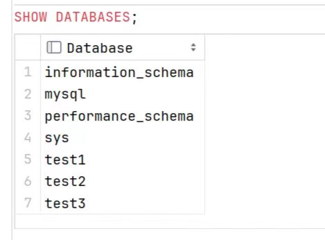
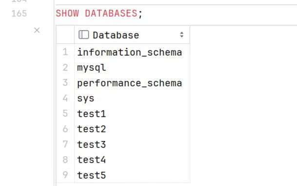
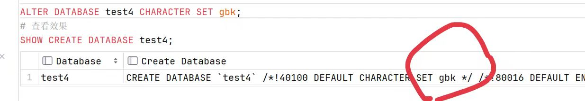
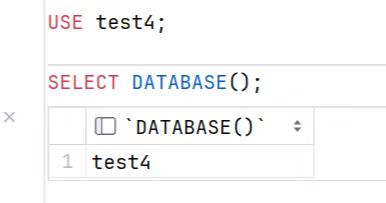
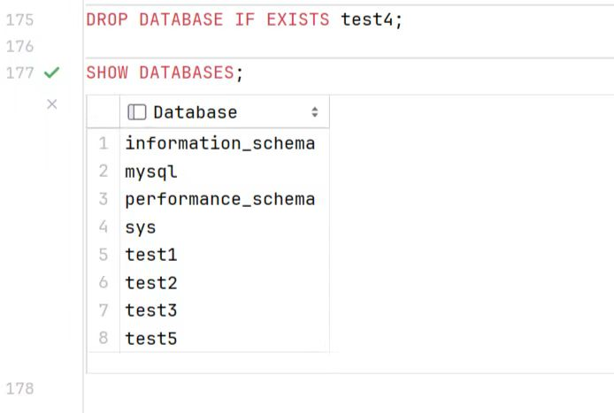

# 数据库的操作

> 实验 **[数据库 test3 源文件](code/test3.sql)** （由 DataGrip 导出，可导入数据库）

### 查看数据库 `SHOW`

+ #### 查看已有数据库

```sql
    SHOW DATABASES;
```



+ #### 查看数据库创建信息

```sql
    # test3是已存在的数据库
    SHOW CREATE DATABASE test3;
```


### 创建数据库 `CREATE`

+ #### 创建数据库

```sql
    # 使用默认字符集(已经通过修改配置文件修改默认字符集为utf8了)
    CREATE DATABASE test4;
```

+ #### 判断数据库不存在再创建, 并指定字符集和校对集：

```sql
    CREATE DATABASE IF NOT EXISTS test5  
    CHARACTER SET utf8  
    COLLATE utf8_general_ci;
```

+ #### 查看已有数据库来验证操作是否成功

```sql
    SHOW DATABASES;
```



### 修改数据库 `ALTER`

+ #### 修改数据库的字符集：

```sql
    ALTER DATABASE test4 CHARACTER SET gbk;
    # 查看效果
    SHOW CREATE DATABASE test4;
```



### 选择数据库 `USE`

+ #### 选择使用的数据库

```sql
    USE test4;
```

+ #### 查看当前正在使用的数据库

```sql
    SELECT DATABASE();
```



### 删除数据库 `DROP`

+ #### 删除数据库如果存在

```sql
    DROP DATABASE IF EXISTS test4;
    # 查看效果
    SHOW DATABASES;
```



