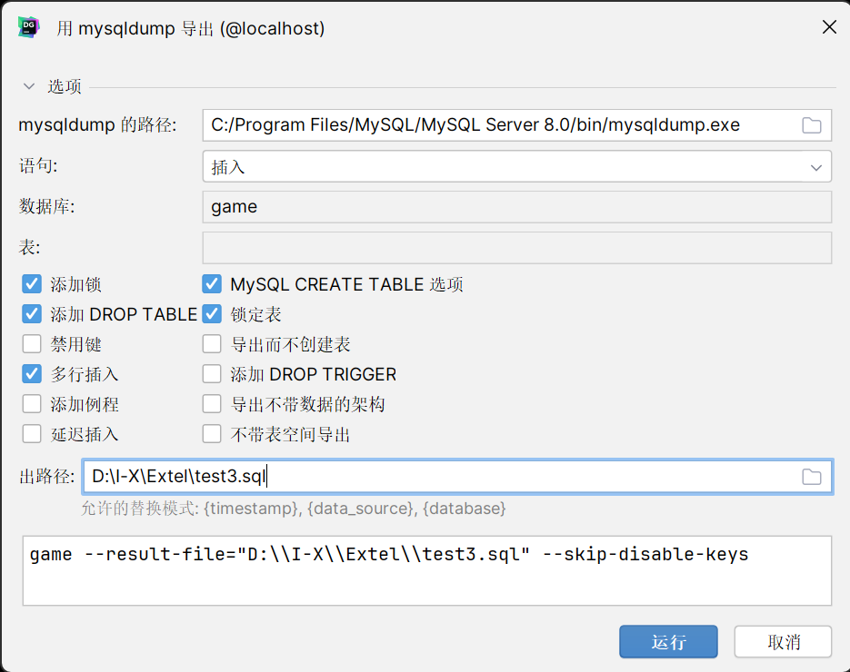

# 备份与恢复

作为一个数据库管理员或者运维人员，定期备份线上的 MySQL 数据库是一个很有必要的工作。它可能帮你在数据库遭到损坏的时候保留数据或者恢复备份。

MySQL 提供了 mysqldump 工具用于从 MySQL 数据库服务器中导出数据库结构和数据。

> 可以实现数据的完全备份、差分备份、增量备份，不过由于本次实验数据量较小，且使用 DataGrip 作为实验环境，仅测试完全备份，以便完全在 DataGrip 中进行。更多备份方法可以参看这个[回答](https://zhuanlan.zhihu.com/p/396005871)

### mysqldump 介绍

mysqldump 工具一般会随着安装 MySQL 数据库时自动安装。它能将一个或者多个数据库，或者数据库中的一个或者多个表导出为一个 SQL 文件，包括 DDL 语句和 DML 语句。

通常，安装完 MySQL 服务器后，可以直接使用 mysqldump 工具。

如果找不到 mysqldump 工具，请将 MySQL 安装目录下的 bin 目录配置到环境变量 PATH 中。 或者导航到 MySQL 安装目录下的 bin 目录下再使用 mysqldump 工具。

### 在 DataGrip 中使用 mysqldump 完全备份数据库

选中希望备份的数据库文件，右键选择 `导入/导出`，在弹出的选项中选择 `用'mysqldump'导出`，将会出现下述窗口

选择 mysqldump.exe 的路径和导出文件的路径，选择导出的规则，点击导出即可。

### 在 DataGrip 中通过备份文件恢复数据库

备份数据库后我们可以删除该数据库并进行还原，需要注意的是使用 DataGrip 进行还原时，如上图，我们选中 game 进行备份，实际上只备份了 game 内的表，因此如果删除 game 数据库，还原时需要先建 game 表，再选中 game，如上操作，选中使用 `使用'mysql'还原`，将出现下述窗口，选择 mysql.exe 路径，点击还原即可。

> 注意，还原后需要刷新数据库，否则无法看到还原效果，这是 DataGrip 的一个设计问题。
